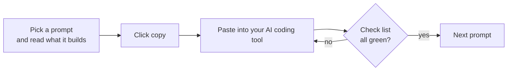

  

**[Copy the full prompt](prompts/00-FULL-APP-PROMPT.md)** &nbsp;·&nbsp; **[Prompt per feature](prompts/README.md)** &nbsp;·&nbsp; **[Architecture](docs/00-architecture.md)** &nbsp;·&nbsp; **[3D UI prompts](docs/ui-3d-prompts.md)**

---

## What is LIA?

LIA is an Android voice-first AI companion. You talk to it in **Hindi, Hinglish or English**, in real time. It opens apps, calls people, prepares messages, chats in text, and can **build a full animated website while you watch it happen in 3D**.

This repository is a **build guide**. Pick a prompt, click copy, paste it into any capable coding AI (Claude Code, Cursor, and so on), and it builds that part of the app. There is one **full prompt** for the whole app, and one **prompt per feature** if you prefer to go step by step.

> Documentation only. No source code, API keys, signing keys or private configuration are in this repo.

<table>
<tr>
<td width="50%" valign="top">

### Talk, don't type
Full-duplex voice over **Gemini Live**. Barge in any time, switch language mid-sentence, pick one of **10 personalities**. A glowing screen edge shows when Lia is listening.

### Does things on the phone
Open apps, call contacts, prepare WhatsApp or SMS messages. The `direct` build can also read the screen, tap, type, scroll, and post to Instagram or Facebook, always **asking before anything irreversible**.

</td>
<td width="50%" valign="top">

### A real 3D presence
Lia is a lit **3D sphere** shaded per pixel on the GPU. It tilts its light with your phone and ripples with your voice.

### Builds websites live
Say *"Lia, ek cafe ki animated website banao"* and a **3D Forge** opens. Stages, sections and log cards come from the real stream, then the finished site is revealed.

</td>
</tr>
</table>

---

## See it

Three real captures from a phone: the reactor core charges while the idea is read, glass slabs stack as sections appear, and the stage ring lights up as visuals are built.

  

The orb: an AGSL fragment shader with analytic sphere normals, a fractal-noise energy interior, tilt-driven light, a fresnel rim and voice-reactive ripples.

---

## Pick your prompt

Every prompt has a **name**, a plain-language line saying **what it will build**, a **copy button**, and a **check list** so you know it worked.

### Option A: one prompt, the whole app

| Prompt | What it builds |
|---|---|
| [**FULL PROMPT: the complete Lia AI app**](prompts/00-FULL-APP-PROMPT.md) | The full Android app in 15 parts: real-time Hindi/Hinglish/English voice (Gemini Live), 10 personalities, phone actions, text chat, 3D orb and UI, and the live 3D Website Forge. Paste it into a big-context AI and let it build part by part. |

### Option B: one prompt per feature (recommended)

Run them in order. Each one says which prompts must be done first.

**Foundation**

| # | Prompt (copy this) | What it builds | How it works |
|:-:|---|---|---|
| 01 | [**Project Setup & Two Build Flavors**](prompts/01-project-setup.md) | Ek khaali Android project (Kotlin + Jetpack Compose) jo build hota hai. | [logic and diagrams](docs/01-project-setup.md) |
| 02 | [**Settings, State & API Key Storage**](prompts/02-state-and-storage.md) | Gemini API key paste karne aur phone me save karne ka system. | [logic and diagrams](docs/02-state-and-storage.md) |
| 03 | [**10 Personalities & the Hindi / Hinglish / English Brain**](prompts/03-personalities-and-prompts.md) | 10 personalities (Normal, Friendly, Funny, Teacher, Developer, Nautanki aur aur). | [logic and diagrams](docs/03-personalities-and-prompts.md) |

**The voice engine**

| # | Prompt (copy this) | What it builds | How it works |
|:-:|---|---|---|
| 04 | [**Gemini Live Real-Time Voice Client**](prompts/04-gemini-live-client.md) | Gemini Live se real-time, dono taraf bolne wali (full-duplex) voice connection. | [logic and diagrams](docs/04-gemini-live-client.md) |
| 05 | [**Microphone, Speaker & Echo Guard**](prompts/05-audio-and-echo-guard.md) | Saaf mic capture aur low-latency speaker playback. | [logic and diagrams](docs/05-audio-and-echo-guard.md) |
| 06 | [**Voice Session, Auto-Reconnect & Background Service**](prompts/06-voice-session.md) | Ek lambi chalne wali conversation jo screen chhodne par bhi nahi rukti. | [logic and diagrams](docs/06-voice-session.md) |
| 07 | [**Phone Actions: Open Apps, Call, Message, Control Screen**](prompts/07-phone-actions.md) | 'YouTube kholo', 'Mummy ko call karo', 'Rahul ko WhatsApp karo' jaise kaam. | [logic and diagrams](docs/07-phone-actions.md) |
| 08 | [**Text Chat with Gemini**](prompts/08-text-chat.md) | Type karke baat karne wala chat screen, voice wali hi personality ke saath. | [logic and diagrams](docs/08-text-chat.md) |

**The look and feel**

| # | Prompt (copy this) | What it builds | How it works |
|:-:|---|---|---|
| 09 | [**Design System & Theme**](prompts/09-design-system.md) | Poore app ka ek jaisa look: gehri indigo raat + ek marigold accent. | [logic and diagrams](docs/09-design-system.md) |
| 10 | [**3D Orb, 3D Splash & Edge Glow**](prompts/10-3d-visuals.md) | Lia ka asli 3D golak (GPU shader se), jo phone tilt par roshni badalta hai aur awaaz par lehrata hai. | [logic and diagrams](docs/10-3d-visuals.md) |
| 11 | [**All Screens & Navigation**](prompts/11-screens-and-navigation.md) | Home, Voice, Chat, History, Settings, Personality, Orb Style, Permissions, Profile, Privacy, About, Debug. | [logic and diagrams](docs/11-screens-and-navigation.md) |
| 11b | [**3D Look for Every Screen**](prompts/11b-3d-look-for-every-screen.md) | Har screen ko 3D depth wala look dene ke prompts (Home, Voice, Chat, Settings, Forge...). | [3D UI prompts](docs/ui-3d-prompts.md) |

**Advanced features**

| # | Prompt (copy this) | What it builds | How it works |
|:-:|---|---|---|
| 12 | [**Instagram / Facebook / WhatsApp Visual Agent (direct only)**](prompts/12-visual-agent.md) *(direct only)* | Lia app ki screen dekhkar khud buttons dabati hai: post, reel, story, WhatsApp message. | [logic and diagrams](docs/12-visual-agent.md) |
| 13 | [**Access-Key Licensing (direct only)**](prompts/13-access-key-licensing.md) *(direct only)* | Bina valid access key ke direct app voice aur tools nahi chalata. | [logic and diagrams](docs/13-access-key-licensing.md) |
| 14 | [**Website Forge: Live 3D Website Builder**](prompts/14-website-forge.md) | 'Lia, ek cafe ki website banao' bolne par 3D Forge scene khulta hai. | [logic and diagrams](docs/14-website-forge.md) |

**Ship it**

| # | Prompt (copy this) | What it builds | How it works |
|:-:|---|---|---|
| 15 | [**Tests & Release**](prompts/15-testing-and-release.md) | Saare pure logic ke unit tests. | [logic and diagrams](docs/15-testing-and-release.md) |

---

## How to use a prompt

---

## Architecture at a glance

Three independent engines share only the API key, the personality settings and the theme: the **voice engine**, the **text engine** and the **Forge**. Full diagrams are in [`docs/00-architecture.md`](docs/00-architecture.md).

---

## Two builds, one codebase

| | `direct` (website / sideload) | `play` (Google Play) |
|---|:-:|:-:|
| Voice, chat, 3D UI, personalities | ✔ | ✔ |
| Website Forge | ✔ | ✔ |
| Open app, call, message (user taps Send) | ✔ | ✔ |
| Read screen, tap, type, scroll (Accessibility) | ✔ | removed at compile time |
| Instagram / Facebook / WhatsApp visual agent | ✔ | removed at compile time |
| Access-key licensing | ✔ | not included |

Google Play restricts the Accessibility API, so the `play` build physically does not contain those classes. Gemini is also only *told about* the tools that exist in the build, so it cannot call a missing one.

---

## Design principles the whole app follows

- **Never block the main thread.** Package scans, contacts, network and audio run off it.
- **No hardcoded secrets.** The Gemini key is pasted in Settings and stored locally.
- **No silent sending.** In the Play build a message only opens the composer.
- **Ask before irreversible actions**, and say so honestly when success could not be verified.
- **Tokens, not hex.** Every screen reads colours from the theme; everything has a reduced-motion path.

## Tech

Kotlin · Jetpack Compose · Material 3 · OkHttp (WebSocket and SSE) · `org.json` · DataStore · AGSL `RuntimeShader` · WebView + Three.js · Gemini Live API · Gemini `generateContent`

## License

Documentation only. Use it freely to build your own assistant.
