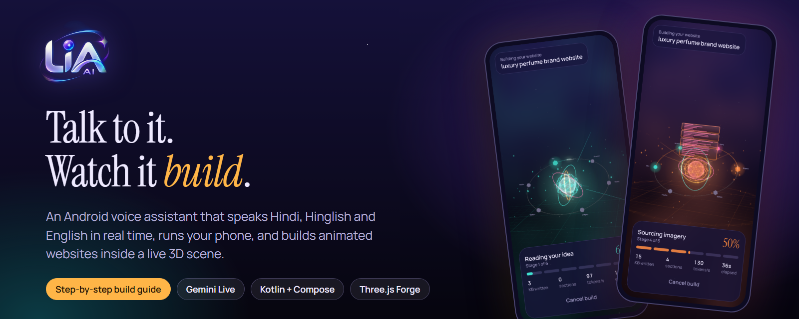
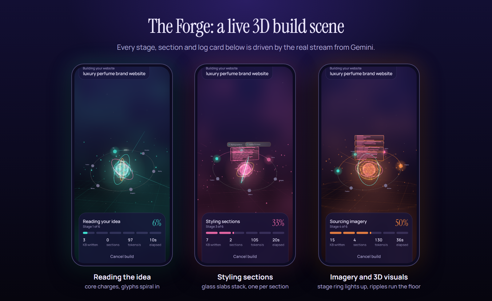
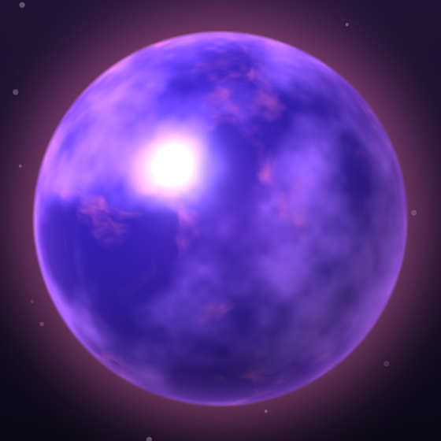
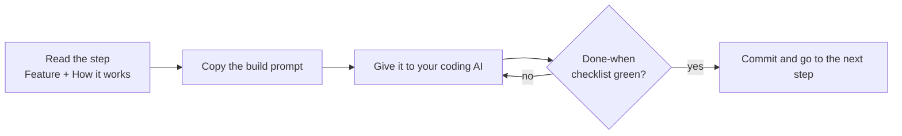
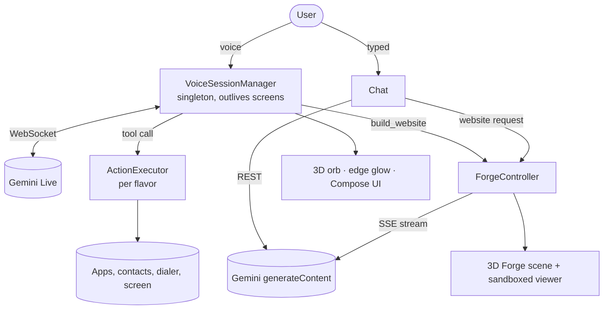

  

**[Start with Step 01](docs/01-project-setup.md)** &nbsp;·&nbsp; **[Architecture](docs/00-architecture.md)** &nbsp;·&nbsp; **[3D UI prompts](docs/ui-3d-prompts.md)** &nbsp;·&nbsp; **[Master prompt](MASTER-PROMPT.md)**

---

## What is LIA?

LIA is an Android voice-first AI companion. You talk to it in **Hindi, Hinglish or English**, in real time. It opens apps, calls people, prepares messages, chats in text, and can **build a full animated website while you watch it happen in 3D**.

This repository is a **build guide**: it explains every feature, how it works, and gives you a **copy-paste prompt for each step** so any capable coding AI (Claude Code, Cursor, and so on) can rebuild the whole app, one step at a time.

> Documentation only. No source code, API keys, signing keys or private configuration are in this repo.

<table>
<tr>
<td width="50%" valign="top">

### Talk, don't type
Full-duplex voice over **Gemini Live**. Barge in any time, switch language mid-sentence, pick one of **10 personalities**. A glowing screen edge shows when Lia is listening.

### Does things on the phone
Open apps, call contacts, prepare WhatsApp or SMS messages. The `direct` build can also read the screen, tap, type, scroll, and post to Instagram or Facebook, always **asking before anything irreversible**.

</td>
<td width="50%" valign="top">

### A real 3D presence
Lia is a lit **3D sphere** shaded per pixel on the GPU. It tilts its light with your phone and ripples with your voice.

### Builds websites live
Say *"Lia, ek cafe ki animated website banao"* and a **3D Forge** opens. Stages, sections and log cards come from the real stream, then the finished site is revealed.

</td>
</tr>
</table>

---

## See it

Three real captures from a phone: the reactor core charges while the idea is read, glass slabs stack as sections appear, and the stage ring lights up as visuals are built.

  

The orb: an AGSL fragment shader with analytic sphere normals, a fractal-noise energy interior, tilt-driven light, a fresnel rim and voice-reactive ripples.

---

## How the guide works

Every step file has the same four parts: **Feature**, **How it works** (logic and diagrams), **Build prompt** (copy-paste), **Done when** (checklist).

Short on time? Paste [`MASTER-PROMPT.md`](MASTER-PROMPT.md) and the AI runs all 15 steps in order by itself.

---

## The 15 steps

### Foundation
| # | Step | You get |
|:-:|---|---|
| 01 | [Project setup & flavors](docs/01-project-setup.md) | Gradle, Compose, `direct` and `play` builds from one codebase |
| 02 | [State, branding & storage](docs/02-state-and-storage.md) | API key store, preferences, app state with hot-swap |
| 03 | [Personalities & prompt builder](docs/03-personalities-and-prompts.md) | 10 personalities, Hindi/Hinglish/English detection, memory recap |

### The voice engine
| # | Step | You get |
|:-:|---|---|
| 04 | [Gemini Live client](docs/04-gemini-live-client.md) | The real-time WebSocket protocol, and the traps that make it hang |
| 05 | [Audio I/O & echo guard](docs/05-audio-and-echo-guard.md) | Mic, speaker, and Lia never hears herself |
| 06 | [Voice session & service](docs/06-voice-session.md) | Conversation lifecycle, auto-reconnect, latency metrics |
| 07 | [Phone actions](docs/07-phone-actions.md) | open app, call, message, tap, type, scroll |
| 08 | [Text chat](docs/08-text-chat.md) | Gemini REST chat with a self-healing model lookup |

### The look and feel
| # | Step | You get |
|:-:|---|---|
| 09 | [Design system](docs/09-design-system.md) | "A pearl of light in the night" tokens, depth, components |
| 10 | [3D visuals](docs/10-3d-visuals.md) | AGSL 3D orb, Canvas orbs, 3D splash, edge glow |
| 11 | [Screens & navigation](docs/11-screens-and-navigation.md) | Home, Voice, Chat, History, Settings and the rest |
| + | [3D UI prompts](docs/ui-3d-prompts.md) | A 3D look prompt for every screen |

### Advanced features
| # | Step | You get |
|:-:|---|---|
| 12 | [Visual social & WhatsApp agent](docs/12-visual-agent.md) | Accessibility-driven agent with a strict state machine (`direct` only) |
| 13 | [Access-key licensing](docs/13-access-key-licensing.md) | Online key gate that fails open (`direct` only) |
| 14 | [Website Forge](docs/14-website-forge.md) | The 3D build scene, streaming, retries, sandboxed result viewer |

### Ship it
| # | Step | You get |
|:-:|---|---|
| 15 | [Testing & release](docs/15-testing-and-release.md) | Test matrix, smoke script, signing, Play Store checklist |

---

## Architecture at a glance

Three independent engines share only the API key, the personality settings and the theme: the **voice engine**, the **text engine** and the **Forge**. Full diagrams are in [`docs/00-architecture.md`](docs/00-architecture.md).

---

## Two builds, one codebase

| | `direct` (website / sideload) | `play` (Google Play) |
|---|:-:|:-:|
| Voice, chat, 3D UI, personalities | ✔ | ✔ |
| Website Forge | ✔ | ✔ |
| Open app, call, message (user taps Send) | ✔ | ✔ |
| Read screen, tap, type, scroll (Accessibility) | ✔ | removed at compile time |
| Instagram / Facebook / WhatsApp visual agent | ✔ | removed at compile time |
| Access-key licensing | ✔ | not included |

Google Play restricts the Accessibility API, so the `play` build physically does not contain those classes. Gemini is also only *told about* the tools that exist in the build, so it cannot call a missing one.

---

## Design principles the whole app follows

- **Never block the main thread.** Package scans, contacts, network and audio run off it.
- **No hardcoded secrets.** The Gemini key is pasted in Settings and stored locally.
- **No silent sending.** In the Play build a message only opens the composer.
- **Ask before irreversible actions**, and say so honestly when success could not be verified.
- **Tokens, not hex.** Every screen reads colours from the theme; everything has a reduced-motion path.

## Tech

Kotlin · Jetpack Compose · Material 3 · OkHttp (WebSocket and SSE) · `org.json` · DataStore · AGSL `RuntimeShader` · WebView + Three.js · Gemini Live API · Gemini `generateContent`

## License

Documentation only. Use it freely to build your own assistant.
