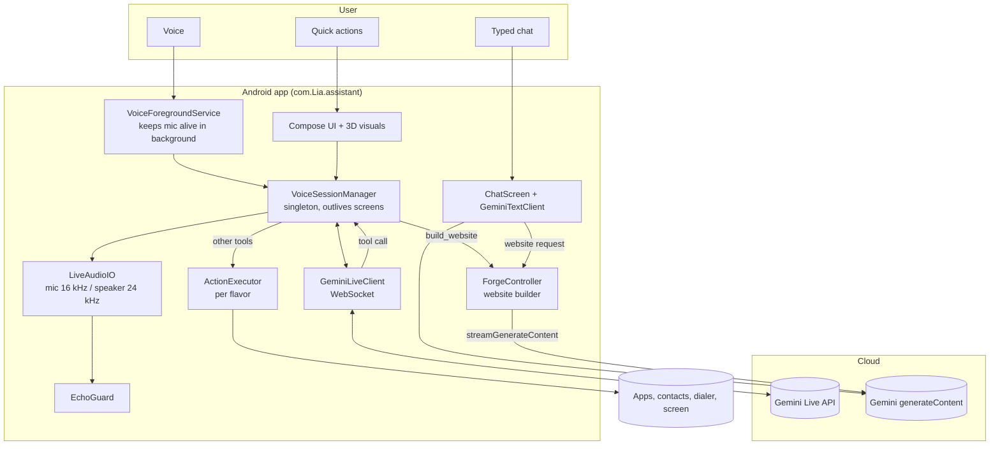
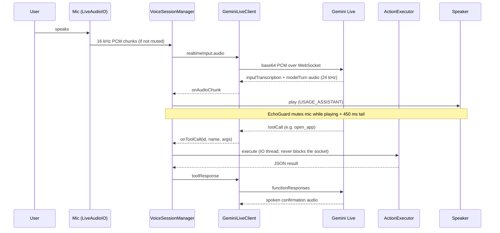
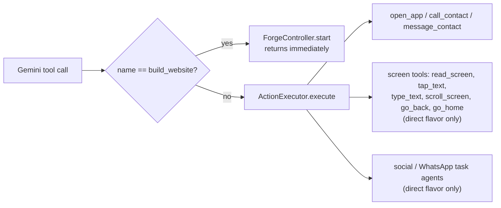

# 00 — Architecture

## The big picture

## Three independent engines

1. **Voice engine** — a live, full-duplex WebSocket conversation with Gemini Live. Lives in a singleton so leaving a screen never kills the conversation.
2. **Text engine** — one stateless REST call per chat turn.
3. **Forge engine** — a long-running, streamed website generation with a 3D progress scene.

They share only the Gemini API key, the personality/language settings and the theme.

## Voice engine data flow

## Tool routing (who handles which tool)

## Package map

| Package | Owns |
|---|---|
| `voice` | Gemini Live client, session manager, audio, echo guard, prompt builder, language detector, tools' orchestration, text client |
| `action` (per flavor) | `ActionExecutor` — the single place a tool name becomes a real Android action |
| `data` | API key store, preferences, DataStore-backed personality repository, app state |
| `forge` | Website Forge: stage detection, streaming client, controller, repository, system prompt |
| `ui/theme` `ui/components` `ui/fx` | tokens, reusable components, 3D orb, edge glow, depth |
| `ui/screens/*` | one package per screen |
| `direct/agent/*` (direct only) | visual social-media and WhatsApp agents, state machine, blockers |
| `direct/license` (direct only) | access-key manager |

## Design rules the whole app follows

- **Never block the main thread**: package scans, contacts, network and audio run on IO threads.
- **No hardcoded secrets**: the Gemini key is pasted in Settings and stored locally.
- **No silent sending**: messages open the composer; the user taps Send in the `play` build.
- **One source of truth per concern**: tool dispatch in `ActionExecutor`, theme in `NovaColors`, build progress in `ForgeController.state`.
- **Everything has a reduced-motion path** and uses theme tokens only.
