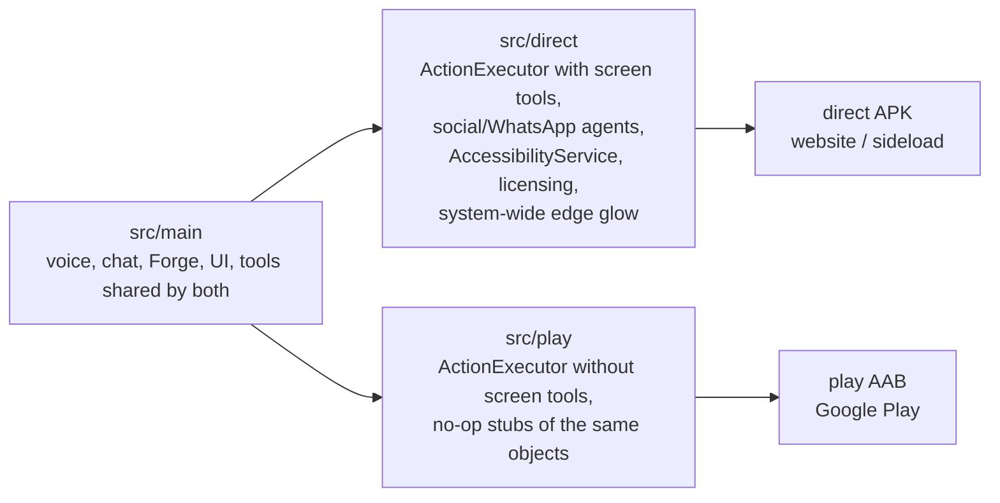

# Step 01 — Project setup & flavors

## Feature
A Compose-only Android project with **two product flavors** that compile different feature sets from one codebase.

## How it works (logic)



Key idea: the `play` flavor does not hide the accessibility code behind a flag — the classes **do not exist** in its source set. Common code calls objects (`ActionExecutor`, `LiaToolCatalog`, `LiaCapabilityPrompts`, `AccessKeyManager`, `OverlayEdgeGlowController`, flavor routes) that each flavor implements differently. `play` gets harmless stubs.

Gemini is also only *told about* tools that exist in the flavor, so it cannot call a missing tool.

## Build prompt (copy-paste)

```text
You are a senior Android engineer. Create an Android app "Lia AI" (applicationId and namespace
com.Lia.assistant) in Kotlin with Jetpack Compose and Material3. No XML layouts.

Tooling:
- Gradle wrapper, Android Gradle Plugin with built-in Kotlin support (do NOT apply
  org.jetbrains.kotlin.android if the AGP version compiles Kotlin natively), Compose compiler
  plugin org.jetbrains.kotlin.plugin.compose.
- compileSdk 36, targetSdk 36, minSdk 26, Java 17.
- Dependencies: compose-bom, core-ktx, core-splashscreen, activity-compose, lifecycle-runtime-ktx,
  lifecycle-runtime-compose, lifecycle-viewmodel-compose, compose ui / ui-graphics /
  ui-tooling-preview, material3, material-icons-extended, navigation-compose,
  kotlinx-coroutines-android, datastore-preferences, okhttp (WebSocket + SSE), androidx.webkit
  (WebViewAssetLoader). Tests: junit, kotlinx-coroutines-test, org.json (for JVM tests).
- No other networking or JSON libraries: OkHttp + org.json only.

Flavors (dimension "distribution"):
- "direct": full app, including AccessibilityService screen control and visual agents.
- "play": everything Google Play's Accessibility policy forbids is REMOVED AT COMPILE TIME.
Create source sets app/src/main, app/src/direct, app/src/play, plus test, testDirect, testPlay.
Anything that differs per flavor (ActionExecutor, LiaToolCatalog, LiaCapabilityPrompts,
AccessKeyManager, OverlayEdgeGlowController, FlavorRoutes, accessibility settings rows) is declared
as the SAME object/function in both src/direct and src/play, so common code compiles against it.
The play versions are safe stubs (no-ops / "unavailable" results).

Manifest: base manifest in src/main has only INTERNET, RECORD_AUDIO, POST_NOTIFICATIONS,
FOREGROUND_SERVICE, FOREGROUND_SERVICE_MICROPHONE, READ_CONTACTS, CALL_PHONE (never SEND_SMS),
the launcher activity, and the voice foreground service (type microphone). The direct manifest
adds QUERY_ALL_PACKAGES, the AccessibilityService, SYSTEM_ALERT_WINDOW and its own FileProvider.
Release build: minify + shrink resources, signing read from a git-ignored keystore.properties.

Deliver: build.gradle.kts, settings.gradle.kts, gradle.properties, the three manifests,
a Hello-World MainActivity that builds for both flavors. Then print the commands to build
assembleDirectDebug and assemblePlayDebug.
```

## Done when
- [ ] `./gradlew assembleDirectDebug assemblePlayDebug` both succeed.
- [ ] The `play` APK's manifest has no AccessibilityService and no `QUERY_ALL_PACKAGES`.
- [ ] `keystore.properties` and `*.jks` are in `.gitignore`.
