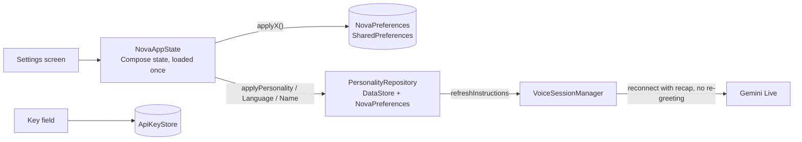

# Step 02 — State, branding & settings storage

## Feature
Everything the user can change (assistant name, personality, language, voice, theme, API key) is saved on the phone and applied **immediately**, even in the middle of a live voice session.

## How it works (logic)



- **ApiKeyStore** — the Gemini key is pasted in Settings, trimmed and stored in local preferences. Never hardcoded, never logged.
- **NovaPreferences** — thin helpers (`get/put String/Boolean/Float`) with a `Keys` object: theme mode, reduced motion, orb style, personality, user name, language, voice name, speech speed, volume, assistant name, onboarding flag.
- **PersonalityRepository** — a singleton over DataStore that exposes `Flow`s for name, personality, language and voice, plus setters that *also* call `VoiceSessionManager.refreshInstructions()`. Gemini Live cannot change its system instruction mid-session, so a live session is **hot-swapped**: reconnect with the new instruction and a short recap of the conversation.
- **NovaAppState** — one plain class created at the navigation root with `mutableStateOf` fields, so every screen reads the same values. Each field has an `applyX()` method that persists it.

## Build prompt (copy-paste)

```text
Add the persistence layer for "Lia AI" (package com.Lia.assistant.data).

1. AssistantBrand: NAME="Lia", FULL_NAME="Lia AI", TAGLINE="Your Intelligent AI Companion".
2. ApiKeyStore (object): SharedPreferences "nova_prefs", key "gemini_api_key".
   getKey(ctx), saveKey(ctx, key) (trim), hasKey(ctx). The key is entered by the user in Settings;
   never hardcode it and never write it to logs.
3. NovaPreferences (object): get/put for String, Boolean, Float on the same prefs file, with a
   Keys object: theme_mode, reduced_motion, orb_style, personality, user_name, voice_input_enabled,
   wake_word_enabled, language, has_onboarded, voice_name, response_style, speech_speed,
   voice_volume, assistant_name.
4. LanguagePreference enum(displayName, description): AUTO ("follows whatever you speak"),
   HINDI, HINGLISH, ENGLISH. Default AUTO.
5. Personality enum(displayName, description, icon, systemInstruction) — details in step 03.
6. PersonalityRepository (singleton, DataStore "assistant_settings"): Flows for personality,
   language, assistant name and voice name (falling back to NovaPreferences), suspend getters,
   and setters that write DataStore AND NovaPreferences, then call
   VoiceSessionManager.refreshInstructions(context) so a live session picks the change up.
7. NovaAppState: a plain class remembered once at the nav root, with Compose mutableStateOf fields
   loaded from NovaPreferences (theme mode default DARK, reducedMotion, orbStyle, personality,
   assistantName, userName, language, voiceName, speechSpeed, voiceVolume, conversations list).
   Every field has an applyX() that saves it. Name them applyX (not setX) to avoid JVM setter
   clashes. applyAssistantName/Language/Personality also update PersonalityRepository on
   Dispatchers.IO.

Rules: no blocking calls on the main thread; DataStore reads in coroutines; unit-test the
fallbacks. Output every file in full.
```

## Done when
- [ ] Changing the personality in Settings while a voice session is live reconnects without the assistant greeting again.
- [ ] Killing and reopening the app keeps every setting.
- [ ] `grep -r "AIza"` finds no key in the repo.
