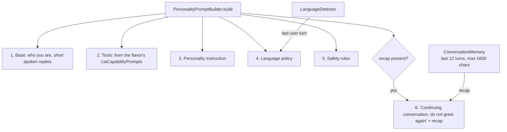

# Step 03 — Personalities, language & prompt builder

## Feature
Ten selectable personalities, automatic Hindi / Hinglish / English matching, and a system prompt that is **built fresh** from the user's choices. Also a small in-memory conversation memory so a reconnect can continue naturally.

## How it works (logic)



- **Personalities** carry an *instruction for the model*, never a canned reply: Normal, Friendly, Professional, Funny, Companion, GF Mode, Teacher, Developer, Hungry, Nautanki. Companion and GF Mode have explicit safety limits (never claim to be human, no explicit content, respect a topic change).
- **LanguageDetector**: any Devanagari character → Hindi. Otherwise it counts Hinglish marker words (`hai`, `kya`, `nahi`, `yaar`, `karo` …). Four words or fewer: one hit is enough. Longer: two hits or 15 % of words. Else English. Blank → unknown.
- **Language modes**: AUTO follows the user turn by turn, and gets a hint ("Their last message was in Hinglish"). HINDI / HINGLISH / ENGLISH are fixed.
- **ConversationMemory** keeps the last 12 turns in memory only, cleared when the session stops. Used only to build the recap after a reconnect or a personality swap.
- Tool instructions come from **per-flavor** `LiaCapabilityPrompts`, so the `play` model is never told it can read the screen.

## Build prompt (copy-paste)

```text
Implement the personality system for "Lia AI" in package com.Lia.assistant.voice and .data.

1. enum Personality(displayName, description, icon, systemInstruction) with NORMAL, FRIENDLY,
   PROFESSIONAL, FUNNY, COMPANION, GF_MODE, TEACHER, DEVELOPER, HUNGRY, NAUTANKI. Each
   systemInstruction is an INSTRUCTION to the model starting "Personality: <name>. ..." — never a
   scripted reply. COMPANION and GF_MODE must say: never claim to be human or have a body, no
   sexually explicit content, immediately respect a request to change tone or topic.
   Default NORMAL.
2. LanguageDetector.detect(text): HINDI if any char in U+0900..U+097F; else lowercase, split on
   [^a-zA-Z']+, count hits in a Hinglish marker set (hai, hain, ho, kya, kyun, kaise, nahi, haan,
   mujhe, tumhe, aap, mera, yaar, bhai, accha, theek, matlab, karna, karo, raha, chahiye, batao,
   suno, dekho, abhi, phir, lekin, bahut, thoda, kuch, sab, wala ...). <=4 words: 1 hit -> HINGLISH;
   longer: >=2 hits or ratio >=0.15 -> HINGLISH; else ENGLISH; blank -> UNKNOWN.
3. ConversationMemory: synchronized rolling window of the last 12 turns (role USER/ASSISTANT +
   text). recap() renders "User: ..." / "You: ..." lines capped to the last 1600 chars. In memory
   only; cleared when the session stops.
4. PersonalityPromptBuilder.build(personality, language, detectedLanguage, recap, assistantName)
   joins, with blank lines: (a) base: "You are {name}, a persistent personal voice assistant living
   on the user's phone. Keep replies short and conversational, like spoken conversation."
   (b) LiaCapabilityPrompts.toolInstruction(name) from the flavor, (c) personality instruction,
   (d) language policy (AUTO: match the user turn by turn and never translate what they said;
   fixed modes: explicit line), (e) safety: never claim to be human, no explicit content, stop a
   topic when asked, vary phrasing, (f) only if recap != null: "This is a continuing
   conversation — do not greet again. Recap: ...".
5. Unit tests: every Personality x LanguagePreference builds; recap section appears only with a
   recap; detector cases (Devanagari, "kya haal hai yaar", "what's the weather", blank).
```

## Done when
- [ ] Switching personality mid-conversation changes tone without a new greeting.
- [ ] "Kya haal hai yaar" gets a Hinglish reply; an English question gets English.
- [ ] Prompt-builder tests pass for all 40 combinations.
