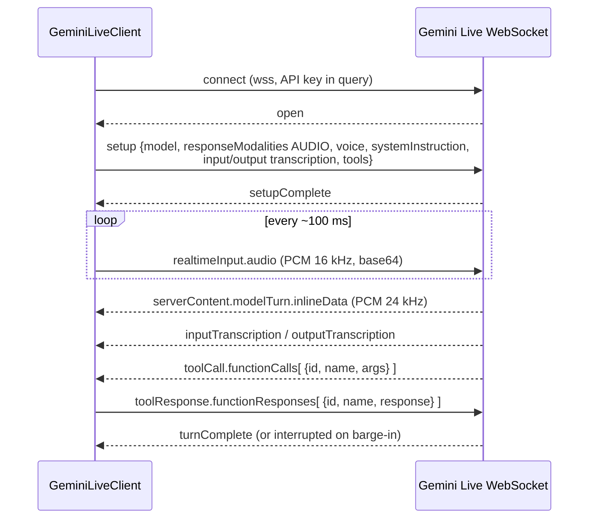

# Step 04 — Gemini Live client

> **Is step ka copy-paste prompt:** [PROMPT 04: Gemini Live Real-Time Voice Client](../prompts/04-gemini-live-client.md)  
> **Ye banayega:** Gemini Live se real-time, dono taraf bolne wali (full-duplex) voice connection.


## Feature
The real-time, full-duplex voice connection. Audio goes up, audio and text transcripts come down, and the model can **call tools** in the middle of a sentence.

## How it works (logic)



Rules that took real debugging and must be kept:

| Rule | Why |
|---|---|
| `speechConfig` with an explicit voice | Without it the model connects but **never replies** |
| `inputAudioTranscription: {}` and `outputAudioTranscription: {}` | Otherwise transcripts never arrive |
| Do **not** override `automaticActivityDetection` | The server default handles Hindi/English pauses better than a short custom timeout |
| Handle **binary** frames as JSON too | The server sometimes sends JSON as binary; dropping them makes the session "connect then hang" |
| Never log raw server messages | They carry base64 audio every ~150 ms; synchronous logging adds real reply latency |
| `ToolCallDeduplicator` per client | A redelivered tool call (tap, type) must never run twice — taps are not idempotent |
| Ignore `sessionResumptionUpdate` / `goAway` | Handled by our own reconnect + recap |
| OkHttp: `readTimeout 0`, `pingInterval 20 s`, no `Origin` header | Long-lived socket |

Close code 1000 → `onClosed`; anything else → `onError`, which triggers the reconnect logic in step 06.

## Build prompt (copy-paste)

_Short version below. The ready-to-copy file with a check list is in [`prompts/`](../prompts/04-gemini-live-client.md)._

```text
Implement GeminiLiveClient (package com.Lia.assistant.voice) with OkHttp WebSocket and org.json.

Constants: MODEL = "models/gemini-3.1-flash-live-preview" (check the Live API docs for the current
native-audio Live model name and keep it in ONE constant); WS_URL =
wss://generativelanguage.googleapis.com/ws/google.ai.generativelanguage.v1beta.GenerativeService.BidiGenerateContent?key=<API_KEY>
OkHttp: readTimeout 0, connectTimeout 20 s, pingInterval 20 s.

API: connect(systemInstruction, voiceName = "Aoede"), sendAudio(pcmBytes), sendToolResponse(id,
name, resultJson), disconnect() (close code 1000). A Listener interface: onSetupComplete,
onAudioChunk(bytes), onInputTranscript(text), onOutputTranscript(text), onToolCall(id, name, args),
onTurnComplete, onInterrupted, onError(message), onClosed.

On open send setup: model, generationConfig.responseModalities ["AUDIO"],
speechConfig.voiceConfig.prebuiltVoiceConfig.voiceName, systemInstruction.parts[0].text,
inputAudioTranscription {}, outputAudioTranscription {}, and tools[0].functionDeclarations from
LiaToolCatalog.declarations() (flavor specific; all params type STRING, parameters type OBJECT).
Do NOT set realtimeInputConfig.automaticActivityDetection.

Outgoing audio: {"realtimeInput":{"audio":{"mimeType":"audio/pcm;rate=16000","data":"<base64 NO_WRAP>"}}}
Tool reply: {"toolResponse":{"functionResponses":[{"id":..,"name":..,"response":{..}}]}}

Incoming: handle BOTH text and binary frames (bytes.utf8()). Parse setupComplete, toolCall.functionCalls[],
serverContent.modelTurn.parts[].inlineData (audio/pcm -> base64 decode -> onAudioChunk, 24 kHz PCM16),
serverContent.inputTranscription.text, outputTranscription.text, turnComplete, interrupted.
Ignore sessionResumptionUpdate and goAway silently. Never log raw server messages or the API key.

Add ToolCallDeduplicator (LinkedHashSet of seen call ids, bounded) owned by the client: a call id seen
before is skipped. Unit-test it. Output every file in full.
```

## Done when
- [ ] You can say "hello" and hear a spoken reply.
- [ ] The transcripts of both sides arrive.
- [ ] Sending the same tool-call id twice runs the tool once.
