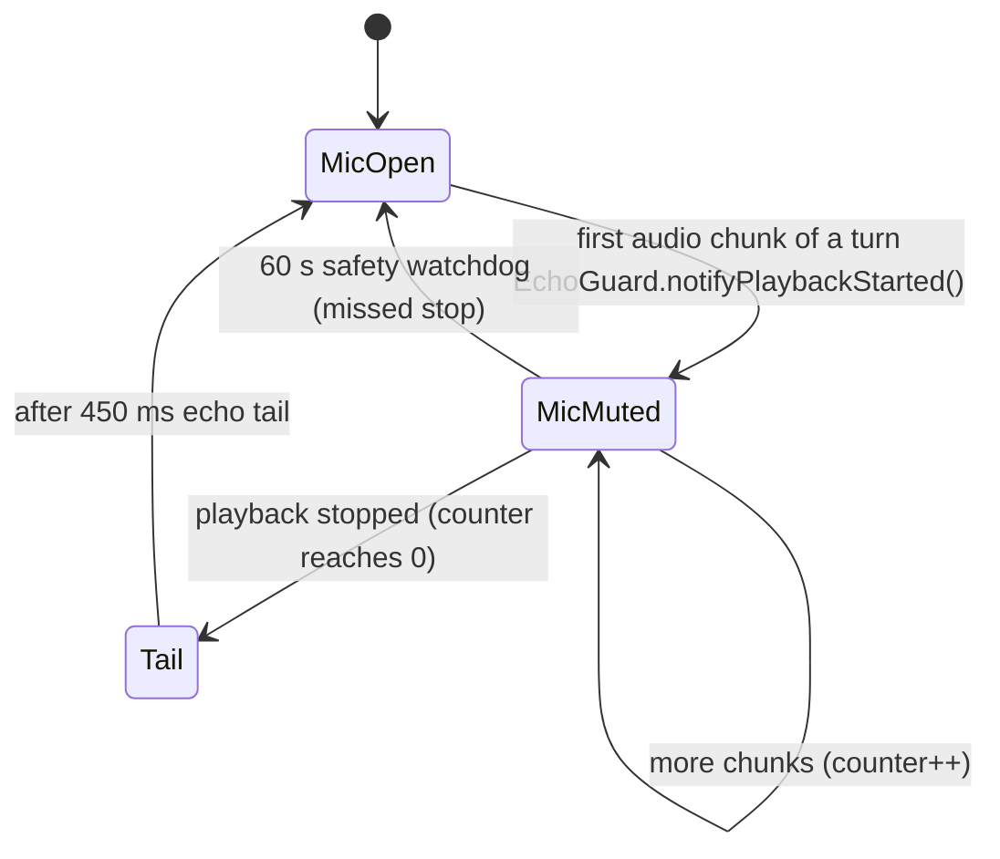

# Step 05 — Audio I/O & echo guard

> **Is step ka copy-paste prompt:** [PROMPT 05: Microphone, Speaker & Echo Guard](../prompts/05-audio-and-echo-guard.md)  
> **Ye banayega:** Saaf mic capture aur low-latency speaker playback.


## Feature
Clean microphone capture, low-latency speaker playback, and **no self-hearing**: Lia never mistakes her own voice from the loudspeaker for the user.

## How it works (logic)



- **Mic**: `AudioRecord` with source `VOICE_COMMUNICATION`, 16 kHz mono PCM16, buffer at least 4096 bytes. Acoustic echo canceler, noise suppressor and AGC are attached when the device has them. 2048-byte chunks are read on a dedicated thread; each chunk reports raw bytes and an RMS amplitude (for the orb).
- **Speaker**: `AudioTrack` 24 kHz mono PCM16, `MODE_STREAM`, buffer `minBuf × 4`, created on the first chunk. Usage is **`USAGE_ASSISTANT` + `CONTENT_TYPE_SPEECH`** — *not* voice-communication, because telephony DSP makes replies sound slow and dragged.
- **Barge-in**: when Gemini says `interrupted`, `flushPlayback()` pauses, flushes and restarts the track so the user can cut Lia off.
- **RMS**: little-endian 16-bit samples, `sqrt(mean(s²)) / 32768`, clamped to 0..1.
- **EchoGuard** is a singleton with a playback counter; the mic stays muted while it is above 0 and for 450 ms after. A 60 s watchdog force-unmutes in case a "stopped" signal is ever missed.

## Build prompt (copy-paste)

_Short version below. The ready-to-copy file with a check list is in [`prompts/`](../prompts/05-audio-and-echo-guard.md)._

```text
Implement LiveAudioIO and EchoGuard in com.Lia.assistant.voice.

LiveAudioIO:
- Mic: AudioRecord(VOICE_COMMUNICATION, 16000, CHANNEL_IN_MONO, ENCODING_PCM_16BIT,
  max(minBufferSize, 4096)). Attach AcousticEchoCanceler, NoiseSuppressor and AutomaticGainControl
  if available (try/catch each). Read 2048-byte chunks on a dedicated thread; call
  onMicChunk(bytes) and onMicAmplitude(rms) for each.
- Speaker: AudioTrack 24000 Hz mono PCM16, AudioAttributes USAGE_ASSISTANT + CONTENT_TYPE_SPEECH
  (NOT USAGE_VOICE_COMMUNICATION), MODE_STREAM, buffer = minBuf * 4, created lazily on first chunk.
  playChunk(bytes) writes and returns that chunk's RMS. flushPlayback() = pause + flush + play.
  setVolume(float). release() frees everything.
- rms(): little-endian PCM16, sqrt(mean(s^2))/32768 clamped to 0..1.

EchoGuard (singleton object): notifyPlaybackStarted() increments an active-playback counter and
mutes; notifyPlaybackStopped() decrements and when it hits 0, unmutes after ECHO_TAIL_MS = 450 ms.
A 60 s watchdog force-unmutes. isMicMuted(), reset(). Unit-test the counter and tail with a fake
clock (kotlinx-coroutines-test).

Keep these latency fixes: USAGE_ASSISTANT playback, 4x buffer, no logging in the audio path.
```

## Done when
- [ ] On the loudspeaker Lia does not answer herself.
- [ ] Speaking over her cuts the audio quickly.
- [ ] The orb reacts to your voice level.
