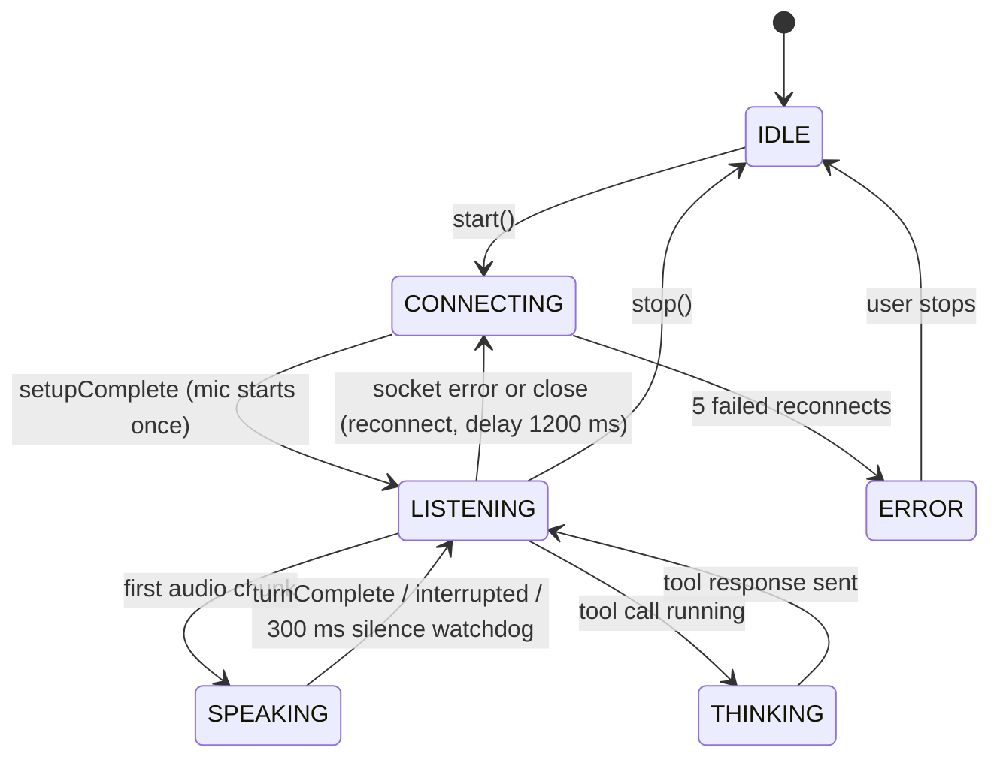

# Step 06 — Voice session & foreground service

> **Is step ka copy-paste prompt:** [PROMPT 06: Voice Session, Auto-Reconnect & Background Service](../prompts/06-voice-session.md)  
> **Ye banayega:** Ek lambi chalne wali conversation jo screen chhodne par bhi nahi rukti.


## Feature
One long-lived conversation object that **survives leaving the screen**, reconnects by itself, and shows live state (listening, speaking, thinking) to the whole UI.

## How it works (logic)



Design decisions:

- **`VoiceSessionManager` is a singleton `object`** with `StateFlow`s (`state`, `amplitude`, `muted`, `statusText`, `isActive`, `lastError`, detected language …). Screens only *observe* it; they never own it.
- **`sessionEpoch`**: every `connectSession` bumps a counter. Each listener callback checks `epoch == currentEpoch` and ignores stale clients, so an old socket cannot touch the new session.
- **Single-flight reconnect**: one job plus a `Mutex`. Delay 1200 ms, then reconnect with `isResuming = true` (the recap is carried over, no re-greeting). After **5** attempts it gives up and shows "Connection lost — tap Stop and reopen Voice Mode".
- **Playback-silence watchdog (300 ms)**: `turnComplete` can arrive seconds late after a tool call. If no audio arrives for 300 ms the turn is ended locally, otherwise the mic would stay muted.
- **Tool calls never block the socket thread**: `onToolCall` launches a coroutine, runs the action on IO and sends the response only if the epoch is still current. `build_website` is handled here (fire-and-forget) instead of in `ActionExecutor` because it starts a long build.
- **`VoiceForegroundService`** (type `microphone`) shows "Lia is listening" with a **Stop** action. It is what keeps the conversation alive when the app is in the background.
- **`VoiceLatencyTracker`** records per-turn timestamps (speech start/end, first response, first audio chunk, playback start) and derives *speech end → first audio* in ms. It feeds the Debug screen only; it never gates anything.
- The installed-apps cache is **prewarmed** at session start; a cold scan can take 6+ seconds on real devices.

## Build prompt (copy-paste)

_Short version below. The ready-to-copy file with a check list is in [`prompts/`](../prompts/06-voice-session.md)._

```text
Implement the voice session layer in com.Lia.assistant.voice.

VoiceSessionManager (singleton object, independent of any screen) exposing StateFlows: state
(NovaOrbState IDLE/LISTENING/THINKING/SPEAKING/CONNECTING/ERROR), amplitude, muted, statusText,
isActive, lastError, currentPersonality, currentLanguage, detectedLanguage, vadActive.

- start(ctx): if already active return; reset state, clear ConversationMemory, reset reconnect count,
  prewarm InstalledAppLabelCache, create LiveAudioIO, then under a Mutex call
  connectSession(isResuming=false) on an IO scope.
- connectSession: increment sessionEpoch, disconnect the previous client, read personality /
  language / assistant name / voice name from PersonalityRepository, build the prompt (recap only
  when resuming), map UI voice names to Gemini voices (default "Aoede"), connect.
- Listener (every callback checks epoch): setupComplete -> LISTENING and start the mic once;
  audio chunk -> first chunk of a turn calls EchoGuard.notifyPlaybackStarted(), play it, state
  SPEAKING with amplitude, and re-arm a 300 ms playback-silence watchdog that ends the turn;
  turnComplete / interrupted (also flushPlayback) -> EchoGuard.notifyPlaybackStopped(), LISTENING;
  transcripts -> ConversationMemory (user transcript also updates detectedLanguage);
  toolCall -> if name == "build_website" start the Forge and return {result:"forge_started"}
  immediately, else ActionExecutor.execute on IO and sendToolResponse if the epoch is current;
  error/close while active -> scheduleReconnect.
- Mic forwarding: send a chunk only if !muted && !EchoGuard.isMicMuted().
- scheduleReconnect: single-flight (job + mutex), delay 1200 ms, connectSession(isResuming=true);
  after 5 attempts set ERROR with "Connection lost - tap Stop and reopen Voice Mode".
- refreshInstructions(ctx): if active, reconnect with isResuming=true (Live cannot change the system
  instruction mid-session).
- toggleMute(), stop() (cancel jobs, bump epoch, disconnect, release audio, reset EchoGuard, clear
  memory, isActive=false).

VoiceForegroundService: channel "<name> voice session" (IMPORTANCE_LOW), ongoing notification
"<name> is listening" with a Stop action (ACTION_STOP). onStartCommand: STOP -> stop session,
stopForeground(REMOVE), stopSelf; else startForeground + VoiceSessionManager.start(); START_STICKY.

VoiceLatencyTracker: per-turn timestamps and derived deltas, plus reconnectCount StateFlow.
Unit-test the tracker (in-order marks give right deltas, out-of-order marks ignored).
```

## Done when
- [ ] Leaving Voice Mode keeps the conversation running; the notification's Stop ends it.
- [ ] Turning off Wi-Fi for 3 seconds reconnects without a re-greeting.
- [ ] After 5 failed reconnects the UI shows the error state.
