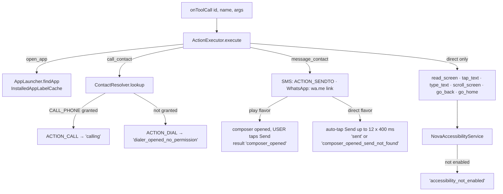

# Step 07 — Phone actions (tools)

> **Is step ka copy-paste prompt:** [PROMPT 07: Phone Actions: Open Apps, Call, Message, Control Screen](../prompts/07-phone-actions.md)  
> **Ye banayega:** 'YouTube kholo', 'Mummy ko call karo', 'Rahul ko WhatsApp karo' jaise kaam.


## Feature
Lia can *do* things: open an app, call a contact, prepare a message, and (in the `direct` build) read the screen, tap, type and scroll. Gemini decides when to call a tool; the app executes it and reports a result the model can speak about.

## How it works (logic)



### Tool list per flavor

| Tool | `play` | `direct` |
|---|---|---|
| `open_app(app_name)` | yes | yes |
| `call_contact(contact)` | yes | yes |
| `message_contact(contact, message, app)` | opens composer, **user taps Send** | opens composer and taps Send |
| `read_screen`, `tap_text`, `type_text`, `scroll_screen`, `go_back`, `go_home` | — | yes |
| `execute_social_media_task`, `social_media_task_control`, `execute_whatsapp_task`, `whatsapp_task_control` | — | yes (step 12) |
| `build_website(prompt)` | yes (handled in the session manager, step 14) | yes |

### Details that matter
- **AppLauncher.findApp**: exact label match first; otherwise candidates where the key is ≥ 3 characters and one is a prefix of the other, or every query word prefix-matches a key word. Never loose substring matching. `InstalledAppLabelCache` is a process-wide `label → package` map with a 15-minute TTL.
- **ContactResolver**: if the query *looks like a number* use it directly; otherwise needs `READ_CONTACTS`, queries `Phone.CONTENT_URI` with `DISPLAY_NAME LIKE`, ranks exact > prefix > contains. Sealed result: `Found`, `NoPermission`, `NotFound`.
- **No `SEND_SMS`, no `SmsManager`**. Messages always go through a visible composer.
- **Accessibility**: `clickOnElementByText` does a BFS for a node whose text or description contains the target and clicks it or its nearest clickable ancestor; `readScreen` returns short unique lines like `[input] Search`, `[tap] Play`, `[text] …`.
- **Gemini is only told about the tools that exist in the flavor** (per-flavor `LiaToolCatalog` and `LiaCapabilityPrompts`), so `play` can never call a screen tool.

## Build prompt (copy-paste)

_Short version below. The ready-to-copy file with a check list is in [`prompts/`](../prompts/07-phone-actions.md)._

```text
Implement phone actions for Lia in com.Lia.assistant.action and .voice, with the flavor split from
step 01.

Common (src/main): AppLauncher, InstalledAppLabelCache, ContactResolver, CommIntents,
functionDecl(name, description, params, required) helper producing a Gemini function declaration
(all params type STRING).

InstalledAppLabelCache: process-wide map lowercase label -> package for launchable apps, built once
on IO under a mutex, 15-minute TTL, prewarm() fire-and-forget, suspend get().
AppLauncher.findApp: exact label match first; else candidates with key length >= 3 where key
startsWith query or query startsWith key or every query word prefix-matches some key word; pick the
closest label length. Never loose substring matching. launch() uses getLaunchIntentForPackage and
catches ActivityNotFound/SecurityException.
ContactResolver.lookup: if the query looks like a phone number (digits/space/+-(). and >=5 digits)
return it directly; else require READ_CONTACTS, query Phone.CONTENT_URI with DISPLAY_NAME LIKE
%name% (limit 5), rank exact > prefix > contains. Sealed result Found/NoPermission/NotFound.

src/play: ActionExecutor handles open_app, call_contact, message_contact only. call_contact uses
ACTION_CALL when CALL_PHONE is granted ("calling") else ACTION_DIAL
("dialer_opened_no_permission"). message_contact opens SMS (ACTION_SENDTO smsto: + sms_body) or
WhatsApp (https://wa.me/<digits>?text=<encoded>, package com.whatsapp or com.whatsapp.w4b if
installed) and returns "composer_opened" — the USER taps Send. Never SmsManager, never SEND_SMS.
LiaToolCatalog.declarations() lists only these 3 tools; LiaCapabilityPrompts says plainly that
the assistant cannot read or control the screen and cannot post to social apps.

src/direct: the same plus read_screen, tap_text, type_text, scroll_screen, go_back, go_home through
NovaAccessibilityService (static instance set in onServiceConnected, isEnabled(ctx) checks
Settings.Secure.ENABLED_ACCESSIBILITY_SERVICES). Results: accessibility_not_enabled, tapped /
element_not_found, typed / no_focused_field, scrolled / nothing_scrollable, done / failed.
message_contact additionally auto-taps Send: up to 12 tries, wait 400 ms, (WhatsApp) tap "Continue
to chat" if present, tap "Send" -> "sent", else "composer_opened_send_not_found".
readScreen(maxElements=40, maxLabelLength=40): BFS, unique lines like "[input] Search".
Service config: eventTypes windowStateChanged|windowContentChanged, canRetrieveWindowContent,
canPerformGestures, notificationTimeout 100.

All tools return a JSONObject; an unknown tool returns {"error": "Unknown tool: <name>"}.
Unit-test AppLauncher matching, ContactResolver ranking and the no-device fallbacks.
```

## Done when
- [ ] "YouTube kholo" opens YouTube; an unknown app returns `not_found` and Lia says so.
- [ ] "Mummy ko call karo" dials (or opens the dialer without permission).
- [ ] In `play`, a message only ever opens the composer.
