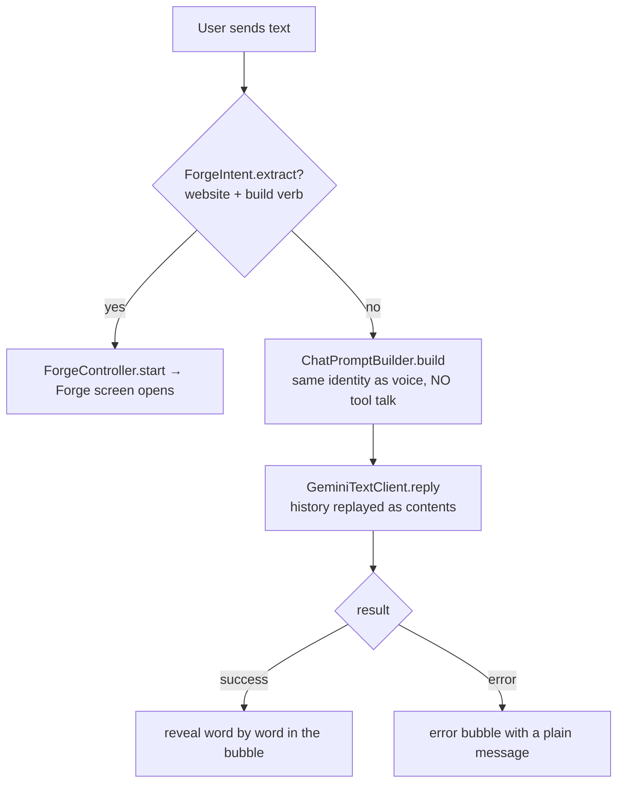

# Step 08 — Text chat

> **Is step ka copy-paste prompt:** [PROMPT 08: Text Chat with Gemini](../prompts/08-text-chat.md)  
> **Ye banayega:** Type karke baat karne wala chat screen, voice wali hi personality ke saath.


## Feature
A typed conversation with the *same* Lia (same personality, language and name), using plain Gemini `generateContent` — no microphone needed. Typing "ek cafe ki website bana do" opens the Website Forge instead of replying in text (step 14).

## How it works (logic)



- **Stateless REST**: every turn sends the whole visible conversation as `contents` (roles `user` / `model`) plus the system instruction. That is the standard `generateContent` pattern.
- **Self-healing model lookup**: hardcoding a model id broke chat once (HTTP 404 "not found for generateContent"). Instead, the client asks the API key's own **ListModels** endpoint for a model that supports `generateContent` and is a "flash" model (not live / image / tts), caches it once per process, and reuses it. If Google renames a model, chat keeps working.
- **ChatPromptBuilder** deliberately omits the tool instructions, otherwise the model would "call" tools in prose.
- Errors are honest bubbles: no key ("add one in Settings"), network failure, blocked content. The key is never logged.
- The typed command detector (`ForgeIntent`) needs both a subject (website, web page, landing page, Hindi equivalents) and a build verb (build, create, make, banao, bana do …), and ignores questions like "website kya hota hai?".

## Build prompt (copy-paste)

_Short version below. The ready-to-copy file with a check list is in [`prompts/`](../prompts/08-text-chat.md)._

```text
Implement text chat (common to both flavors) in com.Lia.assistant.voice and ui/screens/chat.

GeminiTextClient (object, OkHttp REST):
- resolveModel(apiKey): GET https://generativelanguage.googleapis.com/v1beta/models?key=...; choose the
  first model whose supportedGenerationMethods contains "generateContent" and whose name contains
  "flash" but not "live", "image" or "tts"; fall back to the first generateContent model. Cache
  once per process (@Volatile). Never hardcode a model id.
- reply(apiKey, systemInstruction, history: List<ChatTurn(isUser, text)>): ChatReplyResult
  (Success(text) | Error(message)). POST models/<model>:generateContent with systemInstruction.parts
  and contents[] of role "user"/"model". Parse candidates[0].content.parts[0].text. Handle: blank key,
  empty history, HTTP errors (log status + Gemini's own reason ONLY, never the key or the user's
  text), IOException ("Couldn't reach Gemini..."), empty/blocked reply.
- Expose the OkHttp client and resolveModel as internal so the Forge can reuse them.

ChatPromptBuilder.build(personality, language, assistantName): base instruction + "this is typed
chat, never mention tapping, listening or speaking" + personality + language policy + safety.
No tool instructions.

ChatScreen: header (back, small live orb, name, "Typing..." / "Here to help"), LazyColumn of
NovaMessageBubble with auto-scroll, floating glass input bar with send on IME action, assistant
bubbles with copy / retry / speak (TextToSpeech created once and shut down on dispose). Show the
reply with a word-by-word reveal (20 ms per word). Before calling Gemini, run
ForgeIntent.extract(text): if it matches, start the Website Forge and add an assistant bubble
("Opening the Forge ...") instead of a Gemini reply.
```

## Done when
- [ ] With a valid key, chat replies in the chosen personality and language.
- [ ] Removing the key shows "No Gemini API key yet - add one in Settings."
- [ ] Renaming the model on the server does not break chat.
