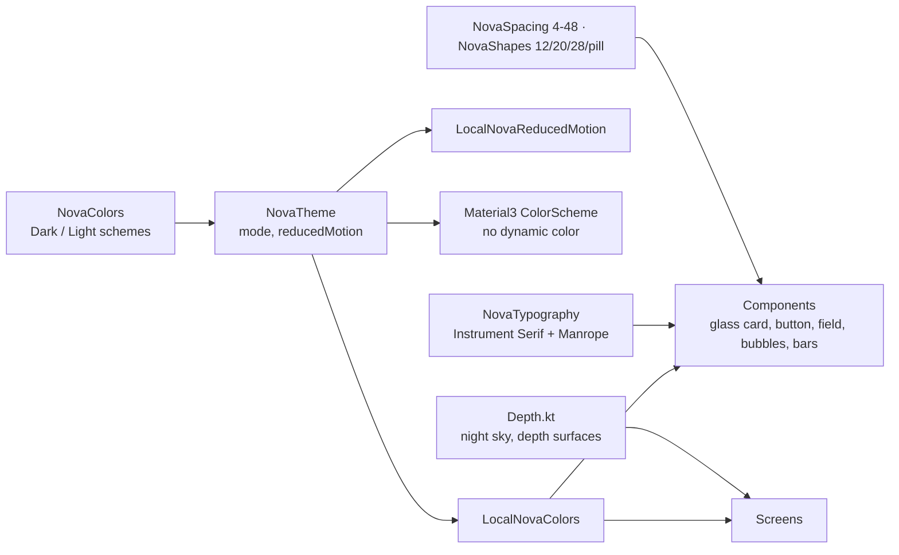

# Step 09 — Design system & theme

## Feature
One token-based design system so every screen looks like the same product, in dark and light, with a "pearl of light in the night" identity instead of a generic dark UI.

## How it works (logic)



### The visual identity
- **Mood**: a deep indigo night (not flat black) with **one warm marigold accent** for everything you can act on. The orb alone carries lotus pink and lagoon teal energy.
- **Dark palette**: background `#06050E`, gradient top `#15113A`, surface `#17143A`, raised surface `#221E4D`, accent marigold `#FFB547`, secondary `#FF8A3D`, text `#EEE9FF`, success lagoon `#3FE0D0`, error `#FF7A85`, lotus `#FF6FAE`.
- **Typography**: **Instrument Serif** (voice: headlines, greetings, orb captions) paired with **Manrope** (UI text, 400–800). Both are bundled as font resources with their OFL licenses.
- **Depth, not drop shadows**: coloured ambient shadow plus a top rim light on raised surfaces; a "night sky" background (gradient + faint stars) lives at the root so the floating nav bar has depth behind it.
- **Scales**: spacing 4 / 8 / 12 / 16 / 24 / 32 / 48 dp; corner radius 12 / 20 / 28 dp / pill; motion 150 / 300 / 500 ms.
- **Rule**: screens read colours from `LocalNovaColors.current`. No hardcoded `Color(0x…)` except in deliberate effects (orb palettes).

### Core components
`NovaGlassCard`, `NovaButton` (primary / secondary / text with a press-scale), `NovaTextField` (password mode), `NovaTopBar`, `NovaSectionHeader`, `NovaSettingsRow`, `NovaMessageBubble`, `NovaOptionPickerDialog`, `NovaSliderDialog`, `NovaEmptyState`, `NovaOrb`, `NovaVoiceVisualizer`, `NovaTypingDots`, floating `LiaBottomNavigation`.

## Build prompt (copy-paste)

```text
Build the design system for Lia AI in com.Lia.assistant.ui.theme and .components. Use Compose and
tokens only; no hardcoded colours in screens.

Identity: "a pearl of light in the night". Deep indigo night background (not flat black), ONE warm
marigold accent for all actionable things, lotus (#FF6FAE) and lagoon (#3FE0D0) reserved for the orb.

NovaColorScheme (data class) with: background, backgroundGradientTop, surface, surfaceGlass,
surfaceBorder, surfaceRaised, accent, accentSecondary, accentGlow, onAccent, textPrimary,
textSecondary, textTertiary, success, warning, error, userBubble, assistantBubble, depthShadow,
rimLight, lagoon, lotus. Provide Dark (background #06050E, gradientTop #15113A, surface #17143A,
raised #221E4D, accent #FFB547, accentSecondary #FF8A3D, text #EEE9FF, textSecondary #A7A0CC) and a
well-contrasted Light scheme (background #F3F0FB, surface #FFFFFF, accent #B86A00, text #15112E).
NovaTheme(mode DARK/LIGHT/SYSTEM, reducedMotion) maps to a Material3 colour scheme (no dynamic
colour), sets status/nav bar colours and icon contrast, provides LocalNovaColors and
LocalNovaReducedMotion.

Typography: bundle Instrument Serif (regular + italic) and Manrope (variable, weights 400-800) as
res/font and ship their OFL licence texts in assets. Serif for display/headline/"voice" lines,
Manrope for title/body/label/caption (title 17/24 semibold, body 15/22, label 13/18, caption 12/16).
Spacing 4/8/12/16/24/32/48, shapes 12/20/28/pill, motion 150/300/500 ms.

Depth.kt: Modifier.nightSky() (gradient + sparse star field, optional tilt parallax),
Modifier.depthSurface(shape, elevation) (coloured ambient shadow + top rim light), and a
LocalBottomBarInset so content can run under the floating nav bar.

Components: NovaGlassCard, NovaButton(PRIMARY/SECONDARY/TEXT, press scale 0.96), NovaTextField,
NovaTopBar, NovaSectionHeader, NovaSettingsRow(icon, title, subtitle, value, switch, onClick),
NovaMessageBubble(ChatMessage(id,text,isUser,isStreaming,isError)), pickers/dialogs, NovaEmptyState,
NovaVoiceVisualizer, NovaTypingDots. Every component honours LocalNovaReducedMotion and exposes
content descriptions. Touch targets >= 48 dp.
```

## Done when
- [ ] A screen built only from components looks right in dark and light.
- [ ] With "reduce motion" on, nothing loops or springs.
- [ ] `grep -rn "Color(0x" ui/screens` returns (almost) nothing.
