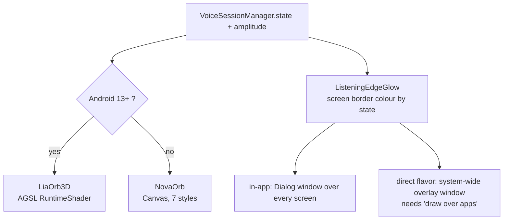

# Step 10 — 3D visuals: orb, splash, edge glow

## Feature
Lia's presence on screen: a **real 3D sphere** shaded per pixel on the GPU, seven Canvas orb styles as fallback and personality, a 3D splash intro, and a glowing screen edge whenever Lia is active.

## How it works (logic)



### LiaOrb3D (AGSL)
One fragment shader draws a lit sphere per pixel:
1. **Analytic sphere normals** from the pixel position (no mesh).
2. A slowly rotating **fbm (fractal noise) interior** as the "energy".
3. **Diffuse + specular lighting** from a light that follows the **phone's tilt** (accelerometer), so the orb feels physical.
4. **Fresnel rim** and a soft outer **halo**.
5. **Voice amplitude** ripples the silhouette and brightens the core.
6. Each state (idle, listening, thinking, speaking, connecting, error) has its own palette and pace.

Android 13+ only (`RuntimeShader`); older devices get the Canvas orb unchanged.

### NovaOrb (Canvas) styles
`NOVA, AURORA, PLASMA, GLASS, ENERGY, MINIMAL, ARCHER`. Layers: radial outer glow; two expanding rings while listening; a rotating arc while connecting; orbiting particles; radial-gradient core. **ARCHER** replaces the core with ~400 particles on a **golden-spiral sphere** (depth-scaled size and alpha, amplitude jitter). Scale by state: listening `1.12 + amp × 0.28`, speaking `1.05 + amp × 0.35`.

### Splash 3D
`LiaSplash3D` plays **once per process** over the already-loading app (rotating or returning from background never replays it) and then reveals Home.

### ListeningEdgeGlow
A slim (≈ 26 dp) coloured border hugging the screen edge: violet when listening, pink when speaking, red on error. In-app it is hosted in a `Dialog` window above every screen, so the live session is visible even when you navigate. The `direct` flavor also shows it system-wide through a `WindowManager` overlay (needs "draw over other apps"); the `play` flavor ships a no-op version because `SYSTEM_ALERT_WINDOW` is not declared there.

## Build prompt (copy-paste)

```text
Build Lia's 3D presence in com.Lia.assistant.ui.fx, ui.components and ui.screens.splash.

1) LiaOrb3D(state, size, amplitude): an AGSL RuntimeShader (Android 13+/API 33) drawing a lit 3D
sphere per pixel: analytic sphere normals from the pixel coordinate, a slowly rotating fbm noise
interior used as an energy field, diffuse + specular lighting from a light direction that follows
the device tilt (SensorManager accelerometer, low-pass filtered, unregistered on dispose), a fresnel
rim, and a soft halo outside the sphere. Pass uniforms: time, resolution, colours (core / rim /
halo), amplitude, tilt. Voice amplitude displaces the silhouette radius and brightens the core.
Palettes per NovaOrbState: IDLE calm lotus/violet, LISTENING lagoon teal with a breathing pulse,
THINKING faster swirl, SPEAKING warm marigold-pink reacting to amplitude, CONNECTING amber slow
spin, ERROR red dim. API < 33: fall back to NovaOrb unchanged. Respect LocalNovaReducedMotion
(freeze time, no tilt).

2) NovaOrb (Canvas fallback + personality styles): enum NovaOrbStyle {NOVA, AURORA, PLASMA, GLASS,
ENERGY, MINIMAL, ARCHER}. Pure Canvas with infinite transitions: breathing (4.2 s sine, +-3.5 %),
rotation (9 s; 2.6 s thinking; 1.1 s connecting). Layers: radial outer glow, two expanding fading
rings while LISTENING, a rotating 100-degree arc while CONNECTING, orbiting particles (ENERGY 8,
PLASMA 6, GLASS 3, else 5; none for MINIMAL/ERROR), a radial-gradient core, a white highlight arc
for GLASS, a pulse ring for ERROR. ARCHER draws ~400 particles on a golden-spiral sphere with
depth-scaled alpha/size, slow rotation and amplitude jitter. contentDescription "<name> status:
<state>".

3) LiaSplash3D: a once-per-process 3D intro (SplashSession.played flag) rendered over the app while
it loads, ending with a callback that removes it. Never replays on rotation or resume.

4) ListeningEdgeGlow: a slim ~26 dp border composable (violet #8B5CF6 resting, pink #FF6FAE speaking,
red #FF7A85 error), drawn with no opinion on hosting. Host it in a full-screen Dialog window in
MainActivity above every screen. Flavor: src/direct OverlayEdgeGlowController shows the same content
in a WindowManager TYPE_APPLICATION_OVERLAY window (needs Settings.ACTION_MANAGE_OVERLAY_PERMISSION,
silently does nothing if not granted), started/stopped from VoiceForegroundService; src/play has a
no-op object with the same signature.
```

## Done when
- [ ] On Android 13+ the orb is a lit sphere that tilts with the phone and ripples with your voice.
- [ ] On older devices the Canvas orb appears with no crash.
- [ ] The edge glow shows while a session is live and disappears on Stop.
