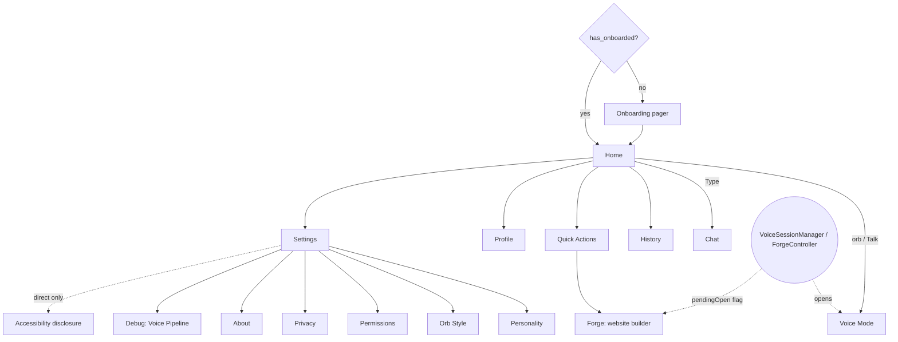

# Step 11 — Screens & navigation

> **Is step ka copy-paste prompt:** [PROMPT 11: All Screens & Navigation](../prompts/11-screens-and-navigation.md)  
> **Ye banayega:** Home, Voice, Chat, History, Settings, Personality, Orb Style, Permissions, Profile, Privacy, About, Debug.


## Feature
The whole app shell: a single `NavHost`, a floating bottom bar with a **Talk orb** in the middle, and every screen.

## How it works (logic)



- **Bottom bar** (`LiaBottomNavigation`): Home · Chat · **Talk orb** · History · Settings. Shown only on those four routes; tab navigation uses `popUpTo(HOME){saveState}`, `launchSingleTop`, `restoreState`. Content runs *under* the floating bar and pads itself with `LocalBottomBarInset`.
- **Start destination**: `HOME` if onboarding is done, otherwise onboarding. The 3D splash is an *overlay* on every cold start, not a route.
- **Opening the Forge from anywhere**: the voice tool, the chat command and the "website ready" notification all set `ForgeController.pendingOpen`. `NovaApp` observes it, navigates to the Forge route once and consumes the flag.
- **Flavor routes**: `registerAccessibilityDisclosureRoute()` registers the disclosure screen in `direct` and nothing in `play`.

## Screens

| Screen | What it shows |
|---|---|
| **Splash** | 3D intro overlay, once per process |
| **Onboarding** | 4 pages (Meet Lia, Just Talk, Your Assistant, Your Privacy Matters), Skip / Continue / Get Started |
| **Home** | Time-based greeting in serif ("Good morning, <name>"), large live 3D orb ("Tap me to talk"), **Talk** and **Type** buttons, "Try saying" example cards, header with logo and profile |
| **Voice Mode** | Mic permission flow (RECORD_AUDIO → notifications → contacts/call, best effort), large orb, status text, mute / stop / close, runs in background |
| **Chat** | Bubbles, glass input bar, typed website command (step 08) |
| **History** | Search, conversation list, archive / delete, empty state |
| **Quick Actions** | Tiles that start a real tool: open app, call, message, talk, ask, **build a website** |
| **Settings** | Profile card; AI & Voice (name, personality, voice, language, speed); Gemini key; Appearance (theme, orb style, reduced motion); Memory; Permissions; Privacy; About; Debug |
| **Personality** | Cards for the 10 personalities, applies instantly |
| **Orb Style** | Live preview (idle / listening / speaking) and the 7 styles |
| **Permissions** | Live status rows with tap-to-grant and "Open settings", re-checked on resume |
| **Profile / Privacy / About** | Name and pairing info, data controls, version and licenses |
| **Debug** | Voice pipeline status and per-turn latency from `VoiceLatencyTracker` |
| **Forge** | Idea prompt → live 3D build → finished site (step 14) |

All visible "Lia" text uses the user's saved assistant name, falling back to `AssistantBrand.NAME`.

## Build prompt (copy-paste)

_Short version below. The ready-to-copy file with a check list is in [`prompts/`](../prompts/11-screens-and-navigation.md)._

```text
Build the app shell and screens for Lia AI (com.Lia.assistant.MainActivity and ui/screens/*). Use the
design system from step 09 and the 3D visuals from step 10. Use the 3D UI prompts in
docs/ui-3d-prompts.md for each screen's look.

MainActivity: installSplashScreen(); setContent { NovaTheme(mode, reducedMotion) { Box { NovaApp(appState);
if (!SplashSession.played) LiaSplash3D(...) ; ListeningEdgeGlow() } } }. Also handle onNewIntent for the
EXTRA_OPEN_FORGE extra by calling ForgeController.requestOpen().

NovaApp: rememberNavController; Scaffold with Modifier.nightSky() and the floating
LiaBottomNavigation (Home, Chat, centre Talk orb -> Voice, History, Settings) visible only on
those 4 routes, providing LocalBottomBarInset to content. NavHost routes: splash, onboarding, home,
chat, history, settings, voice, quick_actions, profile, personality, orb_style, privacy, permissions,
about, debug, forge, plus a flavor route (accessibility_disclosure) registered via
registerAccessibilityDisclosureRoute (direct) / no-op (play). Start at HOME if has_onboarded else
ONBOARDING. LaunchedEffect on ForgeController.pendingOpen: consume it and navigate to forge with
launchSingleTop.

Screens: Onboarding (4-page pager), Home (greeting by time of day in the serif voice font, live
orb, Talk + Type buttons, "Try saying" cards, header with logo + profile), Voice Mode (permission
chain, 240 dp orb, status text, mute/stop/close, starts VoiceForegroundService and does NOT stop it
on dispose), Chat (step 08), History, Quick Actions (tiles that start real tools only), Settings
(sections as in the table), Personality, Orb Style, Permissions (live status rows), Profile,
Privacy, About, Debug.

Rules: dark and light both work via tokens; reduced motion respected; touch targets >= 48 dp;
no screen blocks the main thread; every Lia string uses the saved assistant name.
```

## Done when
- [ ] Fresh install → onboarding → Home; second launch goes straight to Home.
- [ ] The bottom bar hides on Voice, Personality and other detail screens.
- [ ] Saying "ek cafe ki website banao" from anywhere opens the Forge.
