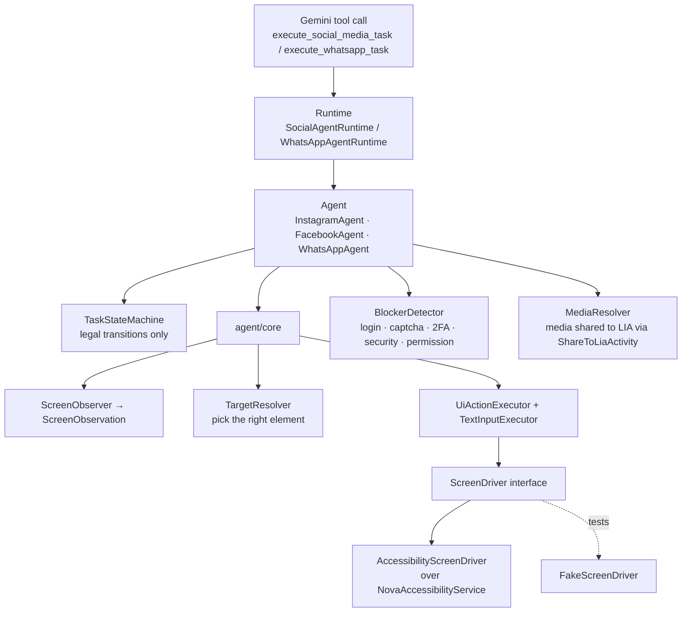
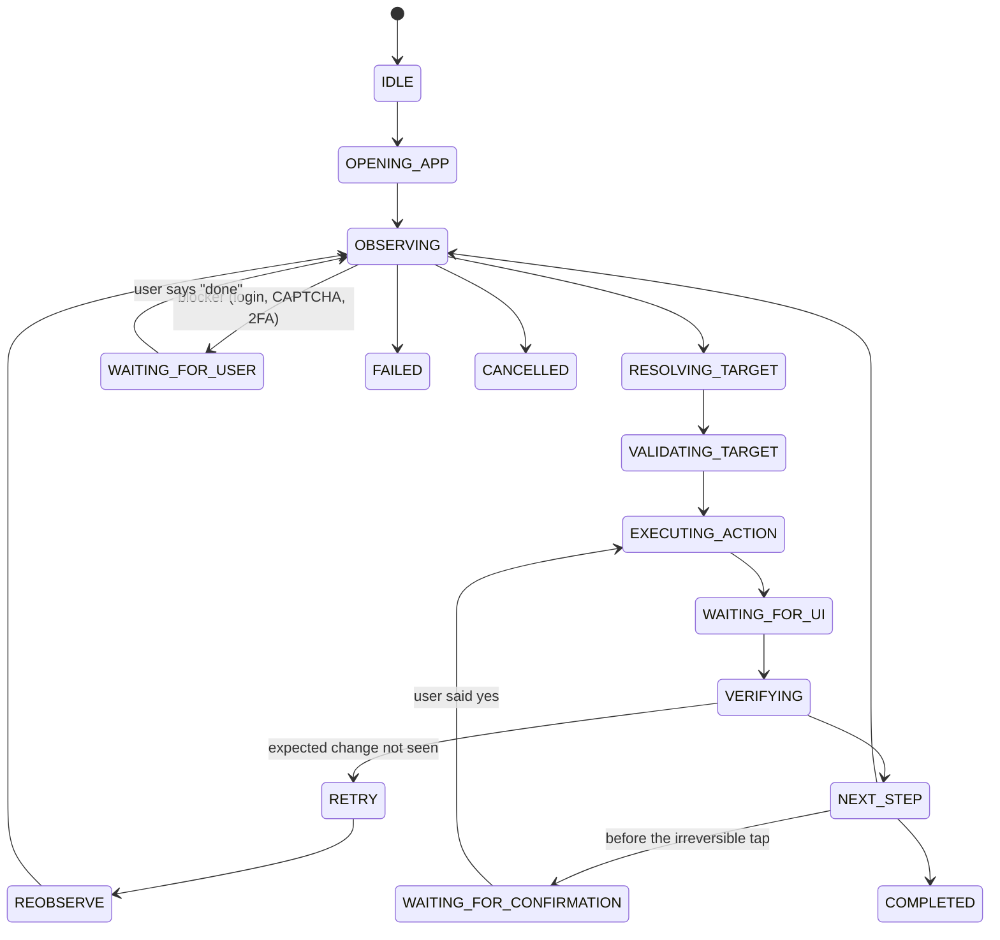

# Step 12 — Visual social-media & WhatsApp agent (`direct` flavor only)

## Feature
"Lia, is photo ko Instagram pe post kar do" or "Rahul ko WhatsApp pe bolo main aa raha hoon". Lia **operates the real app UI** with the Accessibility API: she observes the screen, finds the right button, taps it, verifies the result, and **asks before anything irreversible**.

This whole step lives in `src/direct`. The `play` build has none of these classes.

## How it works (logic)

### Layers



`ScreenDriver` is the **only boundary** with the real device. In production it is the accessibility service; in tests a scripted fake, which is why the agents have a large offline test suite.

### The see → decide → act → verify loop



`FAILED` and `CANCELLED` are reachable from every non-terminal state; nothing leaves a terminal state. An illegal move **throws**, and the agent then fails the task instead of drifting.

### Safety rules
- **Two modes**: `PUBLISH` (prepare everything, then *ask the user* before the final tap) and `DRAFT` (prepare and stop — never publishes).
- Gemini may call `confirm` **only after the user explicitly said yes in this conversation**. `reject`, `resume`, `cancel` and `status` are the other control commands.
- **Blockers** (login, CAPTCHA, two-factor, security check, permission prompt) pause the task as `WAITING_FOR_USER`; the agent never tries to get past them.
- **Media is never picked from the gallery by the agent.** The user shares it to LIA from the gallery's share menu; only a `content://` URI previously shared to LIA is accepted.
- **Verification**: a status of `SUBMITTED_UNVERIFIED` means the tap was done but success could not be proven — Lia says exactly that instead of claiming success.
- Each action records the method used (`ACCESSIBILITY_CLICK`, `GESTURE_ON_ELEMENT_BOUNDS`, `VISION_TAP`, `SET_TEXT`) and failures carry a typed reason.
- A debug overlay and monitor show agent state during development.

### Task shapes

| Agent | Actions | Terminal statuses |
|---|---|---|
| Social (Instagram, Facebook) | feed post (photo/video), reel, story, Facebook text post | `PUBLISHED`, `SUBMITTED_UNVERIFIED`, `DRAFT_READY`, `FAILED`, `CANCELLED`, `REJECTED` |
| WhatsApp | `read_unread` (notifications only, never opens the app), `send_message` (by phone number, like `message_contact`), `read_chat`, `search_chat`, `mute_chat`, `unmute_chat`, `mark_read` | `SENT`, `SUBMITTED_UNVERIFIED`, `DONE`, `FAILED`, `CANCELLED`, `REJECTED` |

## Build prompt (copy-paste)

```text
In src/direct only, implement a visual UI agent for Android using the AccessibilityService from step 07.
Package com.Lia.assistant.agent.

agent/core:
- UiElement, ScreenObservation(observationId, package, window class, elements, screen size,
  windowStamp), CapturedScreen, ScreenObserver (turns a capture into an observation).
- ScreenDriver interface = the ONLY boundary with the device: capture(), clickElement(obs, element),
  gestureTap(x,y), setText(text), scroll, back, home. Results: OK, FAILED, STALE (observation no
  longer latest), NOT_FOUND, UNSUPPORTED. Production impl AccessibilityScreenDriver; tests use a
  scripted FakeScreenDriver.
- TargetResolver(spec -> best element), UiActionExecutor and TextInputExecutor that verify an
  expectation after every action (target gone, text present...) and report ActionResult
  Success / Failed(reason) / Blocked(blocker).
- Enums: ExecPhase, ActionMethod {ACCESSIBILITY_CLICK, GESTURE_ON_ELEMENT_BOUNDS, VISION_TAP,
  SET_TEXT}, Blocker {LOGIN, CAPTCHA, TWO_FACTOR, SECURITY_CHECK, PERMISSION_PROMPT}, FailureReason.

agent/social: Platform {INSTAGRAM, FACEBOOK}, SocialAction {CREATE_POST, CREATE_REEL, CREATE_STORY,
TEXT_POST}, TaskMode {PUBLISH, DRAFT}, TaskStatus, SocialTaskRequest.parse() that validates the model's
arguments BEFORE a task exists, per-platform selectors, MediaResolver (only content:// URIs shared to
LIA through ShareToLiaActivity), BlockerDetector, PlanStep, TaskReport, ControlCommand {CONFIRM,
REJECT, RESUME, CANCEL, STATUS}.

TaskStateMachine: states IDLE, OPENING_APP, OBSERVING, RESOLVING_TARGET, VALIDATING_TARGET,
EXECUTING_ACTION, WAITING_FOR_UI, VERIFYING, NEXT_STEP, RETRY, REOBSERVE, WAITING_FOR_CONFIRMATION,
WAITING_FOR_USER, COMPLETED, FAILED, CANCELLED. moveTo() throws on an illegal transition; FAILED and
CANCELLED are reachable from every non-terminal state; terminal states never exit; keep a history.

Rules: PUBLISH mode pauses at WAITING_FOR_CONFIRMATION before the irreversible tap; DRAFT never
publishes. A blocker pauses at WAITING_FOR_USER. If success cannot be verified, finish as
SUBMITTED_UNVERIFIED and tell the user so. Tool declarations execute_social_media_task(platform,
action, media_uri, caption, mode, target_account) and social_media_task_control(command, task_id).
The description must say: only call confirm after the user explicitly said yes.

agent/whatsapp: WhatsAppAgent with actions READ_UNREAD (via a notification listener, never opens the
app), SEND_MESSAGE (go straight to the chat by phone number), READ_CHAT, SEARCH_CHAT, MUTE_CHAT,
UNMUTE_CHAT, MARK_READ; ambiguity (two matching contacts) fails with "contact_ambiguous" instead of
guessing. Tools execute_whatsapp_task and whatsapp_task_control.

Write a scripted test world (FakeScreenDriver) and unit tests for: every legal and illegal state
transition, blocker pauses, DRAFT never publishing, stale observations, confirm without a prior
yes being refused, and unverified submission reporting.
```

## Done when
- [ ] With a shared photo, "post this on Instagram" prepares the post and **asks before publishing**.
- [ ] A login screen pauses the task and Lia asks you to log in.
- [ ] The state-machine tests prove illegal transitions throw.
