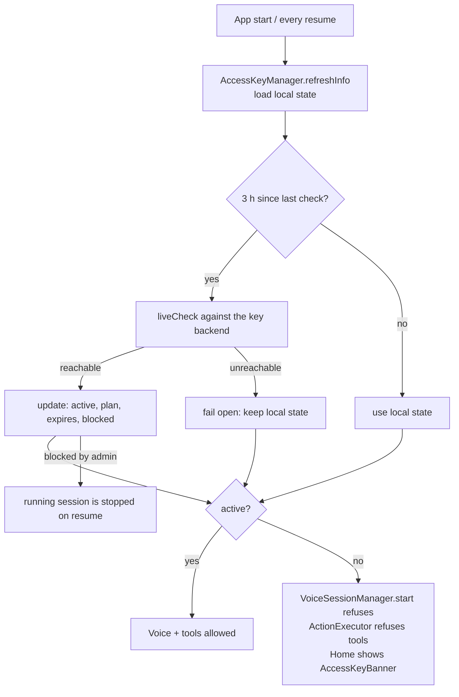

# Step 13 — Access-key licensing (`direct` flavor only)

> **Is step ka copy-paste prompt:** [PROMPT 13: Access-Key Licensing (direct only)](../prompts/13-access-key-licensing.md)  
> **Ye banayega:** Bina valid access key ke direct app voice aur tools nahi chalata.


## Feature
The website / sideloaded build only works with an **active access key**. Without one the voice session does not start and no phone-control tool runs. The Google Play build has no key gate.

## How it works (logic)



- **Local state** (`key, plan, expires_at, active, blocked, last_remote_check`) is kept in private preferences, so the app works offline for a normal key.
- **Throttled live check**: at most once every 3 hours (and on resume) it asks the key backend whether the key is still valid, so an admin *block / unblock* reaches the phone. Network failure **fails open** (keeps the last known state) so a flaky connection never locks a paying user out.
- **Pure rules** live in `AccessKeyRules` (expiry, blocked, plan) and are unit-tested without Android or network.
- **Device id** is derived deterministically so one key can be tied to one device, and the same scheme can serve several apps from the same vendor.
- **UI**: an `AccessKeyBanner` on Home, an `AccessKeySection` in Profile to enter or change the key. The `play` flavor has no-op versions of these composables and of `AccessKeyManager`.
- **Enforcement points**: `VoiceSessionManager.start` and `ActionExecutor.execute` both check the manager, and `MainActivity` re-checks on `ON_RESUME` and stops a running voice session if the key was blocked meanwhile.

## Build prompt (copy-paste)

_Short version below. The ready-to-copy file with a check list is in [`prompts/`](../prompts/13-access-key-licensing.md)._

```text
In src/direct, implement an access-key gate. Package com.Lia.assistant.license. Do not include any
real project ids, URLs or secrets in the repository — read backend configuration from a git-ignored
config file (the way google-services.json is handled) and make the app build and report
"licensing not configured" when it is missing.

- LicenseInfo(active, plan, expiresAt, status text, blocked, hasRememberedKey).
- AccessKeyRules (pure Kotlin): decide active/expired/blocked from plan, expiry timestamp and the
  blocked flag; fully unit-tested, no Android types.
- AccessKeyManager (object): refreshInfo(ctx) loads local state from private SharedPreferences
  ("lia_access_key": key, plan, expires_at, active, blocked, last_remote_check) into a StateFlow;
  activate(ctx, key) validates a key against the remote backend and binds it to a device id;
  liveCheck(ctx) re-checks at most once per 3 hours and FAILS OPEN on network errors;
  an admin "blocked" result makes the key inactive immediately.
- Enforcement: VoiceSessionManager.start and ActionExecutor.execute refuse when the key is not
  active (clear message the model can speak). MainActivity re-runs liveCheck on ON_RESUME and sends
  ACTION_STOP to VoiceForegroundService if a running session's key became blocked.
- UI: AccessKeyBanner (Home) and AccessKeySection (Profile) in src/direct; the same-named
  composables and a no-op AccessKeyManager in src/play so common code compiles for both.
- The play flavor must contain no licensing code paths and no Firebase dependencies.
```

## Done when
- [ ] `direct` without a key: voice refuses to start and the banner explains how to activate.
- [ ] Offline with a previously valid key still works.
- [ ] Blocking a key remotely stops a running session at the next resume.
- [ ] `play` builds without any Firebase / licensing dependency.
