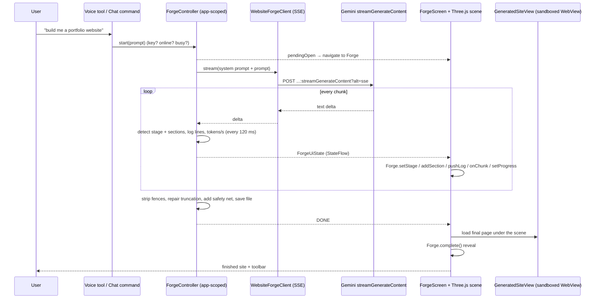
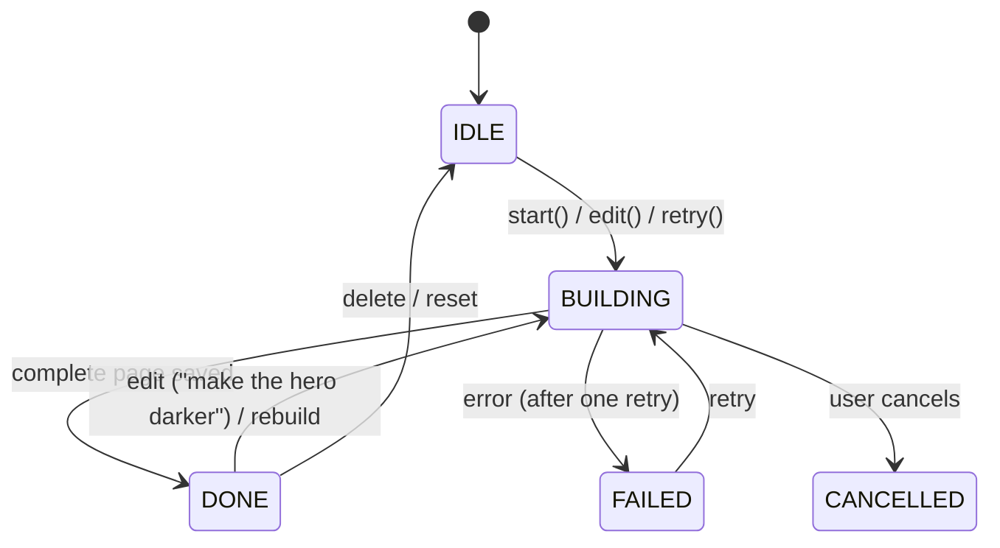
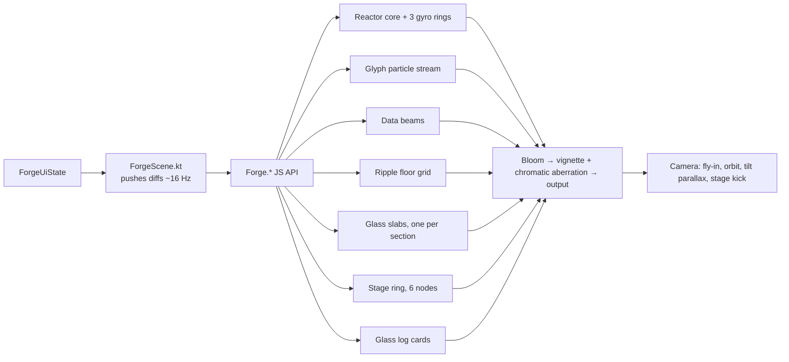

# Step 14 — Website Forge (live 3D build scene)

## Feature
Say **"Lia, ek cafe ki animated website banao"** (or type it). A 3D "Forge" scene opens at once and shows the website being written, driven by the *real* stream from Gemini. When it finishes, the scene punches through into the finished, scrollable, animated website, with share / save / edit tools.

Ported from a desktop assistant (where a fake "cmd" window showed the build). Here the build screen is a real-time 3D scene instead of a terminal.

## How it works (logic)

### End to end



### The controller (single source of truth)

`ForgeController` is a process-wide singleton, so leaving the screen, rotating or backgrounding never kills a build that is a minute into streaming.



`ForgeUiState`: phase, prompt, stage, progress, metrics (chars, sections, seconds, tokens/s), detected sections, recent log lines (+ a sequence number so the scene knows which are new), saved file, error, `buildId`.

### Stages come from the real stream, not timers

| Stage | Detected when |
|---|---|
| Reading your idea | nothing streamed yet |
| Laying out structure | `<body` or the first `<section>` appears |
| Styling sections | 2 or more header/section/footer elements seen |
| Building 3D visuals | a photo URL, `<canvas` or `perspective(` appears in the body |
| Injecting motion | `gsap.` or `ScrollTrigger` appears in the body |
| Finalizing | `</html>` |
| Ready | saved |

Order is chosen to match how Gemini actually writes a page (markup first, scripts last). Progress is `max(stage/6, chars/60 000)` capped at 98 % until done, so it never goes backwards.

### Robust streaming
- **Thinking budget 0** for 2.5-class models. Without it, the first token took **60+ seconds** while the model "thought", and the build screen looked dead.
- **503 / "high demand"** → one automatic retry after 4 s, then a friendly "Gemini is busy" message.
- **`finishReason=RECITATION`** (the model refuses to continue text that looks copied) or any stream that ends without `</html>` → retry once with the hint "write completely original markup and code". A cut-off page of at least 14 000 characters is accepted after repair; shorter fails honestly.
- Errors *inside* a 200 stream (`{"error": …}`) are detected. Output shorter than 1 500 characters is treated as a stub, not a website.
- Fence stripping (` ```html `), truncated-tag repair, `</body></html>` closing.
- Cancel aborts the HTTP call and removes partial state. A notification "Your website is ready" is posted if the Forge screen is not visible.

### The 3D scene ("Forge Reactor")
Three.js (bundled locally, served over `https://appassets…` by `WebViewAssetLoader`, no network, no `file://`) inside a WebView, driven only by these calls:

`Forge.init(theme, pixelRatioCap, lowRam, reducedMotion)` · `setStage(name)` · `setProgress(0..1)` · `onChunk(len, total, tokensPerSec)` · `addSection(name)` · `pushLog(text)` · `complete()` · `fail()` · `setReducedMotion(bool)` · `dispose()`



| Element | Driven by |
|---|---|
| Reactor core: fresnel orb, wire shell, 3 gyroscopic rings | tokens/s (rings spin faster, glow brighter) |
| Code-glyph particles (`{ } < > / = ;`) spiralling in | every chunk (burst size ∝ chunk length) |
| Data beams striking the core | every chunk |
| Floor grid with expanding ripples | new section, stage change, some chunks |
| Glass slabs (rounded, scan-line birth, faux content bars, shimmer) | one per detected section; styled at Styling, shimmer at Motion |
| Stage ring with 6 nodes and an energy arc | stage + progress |
| Floating glass log cards (max 4) | real log lines ("Laying out Hero", "20 KB written") |
| Camera fly-in, orbit, drag + device-tilt parallax, stage kick, shake | time, touch, accelerometer, stage change |
| **Reveal** | slabs fuse into one browser panel, flash + shockwave + particle burst, panel flies into the camera, FOV punch + aberration, then the WebView underneath is revealed (≈ 1.5 s) |
| **Failure / cancel** | scene desaturates, slabs crack and drift apart, core dims |

Performance: pixel ratio capped at 2 (1.5 on low-RAM), instanced/pooled particles, adaptive quality (frames over 20 ms for 1 s → fewer particles; second time → bloom off and resolution 1×), render loop paused when hidden, everything disposed on exit, reduced-motion path that renders only on change. If WebGL fails or the device is low-RAM, a **Compose-only fallback** scene (pseudo-3D slab stack, same stage ring and card feed) uses the same state.

Hard-won layout rule: the WebView must be **MATCH_PARENT**. A wrap-content WebView sizes its viewport to its content, so `height: 100%` resolves to **0** and the canvas is blank.

### The HUD (Compose)
Top glass chip with the prompt ("Building your website"); bottom glass card with the stage name (slide animation), big percentage in the serif voice font, a **six-segment stage track** that fills with real progress, four stats (KB, sections, tokens/s, seconds), a ≥ 48 dp Cancel, light haptic tick on every stage change and a firm one when ready, TalkBack live-region announcements.

### The result viewer
Full-screen `WebView` for the generated page, **sandboxed**: JavaScript on (the page needs Tailwind + GSAP + Three.js), no `addJavascriptInterface` ever, no file/content access, mixed content blocked, geolocation denied, external links go to the system browser. Auto-hiding toolbar: back, share (FileProvider), save to device (Storage Access Framework), open in browser, **edit with text** ("make the hero darker" → re-prompt with the current HTML), rebuild, my websites, delete.

### What the generated website must be (system prompt rules)
Ported from the original builder (single HTML file, Tailwind via CDN, GSAP + ScrollTrigger, picsum / pravatar images only, hero flair, magnetic buttons, bento grids, exact theming, 5–6 sections), then extended for the phone:
- Mobile-first, reduced-motion respected, hamburger nav under 768 px.
- **Photos in at most two sections** (hero and one gallery). Every other section gets a **3D visual**: Three.js scenes in the hero and the CTA, CSS 3D (tilt cards, depth layers, flip cards, cubes) elsewhere.
- Photo sections need a dark gradient overlay so text is readable; each Three.js canvas must fill its section and always show a visible object.
- **Never hide content waiting for an animation** (the cause of "black screens": sections stuck at `opacity: 0` when ScrollTrigger never fired in a WebView).

### Safety net for hidden sections
After generation the app injects a tiny script: anything with real content that has sat at opacity 0 inside the viewport for 1.4 s is faded in. Overlays that are meant to be invisible (fixed, `pointer-events: none`, `aria-hidden`, canvases) are left alone. It is idempotent (marker attribute).

## Build prompt (copy-paste)

```text
Implement the "Website Forge" feature (common to both flavors) in packages com.Lia.assistant.forge and
com.Lia.assistant.ui.screens.forge, plus assets/forge. Read steps 04, 06, 08 and 11 first.

BEHAVIOUR
- Triggers: Gemini Live tool build_website(prompt) (declared in BOTH flavors' LiaToolCatalog, handled
  in VoiceSessionManager.onToolCall before ActionExecutor, returns {"result":"forge_started"}
  immediately), a typed chat command (ForgeIntent: needs a website/web page/landing page subject AND
  a build verb such as build/create/make/bana/banao; ignores questions), and a Quick Actions tile.
- ForgeController (process-wide object, own CoroutineScope): StateFlow<ForgeUiState(phase IDLE/
  BUILDING/DONE/FAILED/CANCELLED, prompt, isEdit, stage, progress, metrics(chars, sections,
  elapsedSec, tokensPerSec), sections, log + logSeq, buildId, file, error)>; pendingOpen flag;
  start(), edit(change), retry(), cancel(), reset(), openSaved(file), partialHtml(). start() returns
  Started/MissingKey/Offline/Busy/NothingToEdit with a spoken-friendly message.
- WebsiteForgeClient: streamGenerateContent?alt=sse on the model resolved by GeminiTextClient's
  ListModels lookup (header x-goog-api-key, read timeout 180 s). For model names containing "2.5"
  send generationConfig.thinkingConfig.thinkingBudget = 0 (otherwise the first token takes a minute).
  Parse SSE "data:" lines (SseParser.extractText / extractError / extractFinishReason), cancel the
  call when the collector is cancelled, log finishReason when it is not STOP (never log keys, prompts
  or HTML).
- Robustness: one automatic retry for overloaded (503/UNAVAILABLE) after 4 s; one retry with the hint
  "write completely original markup, copy and code; finish the whole page" for output that is < 1500
  chars, or ends without </html> (e.g. finishReason RECITATION); accept a truncated page only if >= 14000
  chars (repair open script/style/body/html tags), else fail with "Gemini stopped before finishing".
  Strip ```html fences. Save to filesDir/Websites/website_<timestamp>.html. If the screen is not visible,
  post a "Your website is ready" notification (tap re-opens via EXTRA_OPEN_FORGE).
- ForgeStage enum and ForgeStageDetector.detect(partialHtml) exactly as in the stage table above;
  throttle state emission to every 120 ms; log lines: stage labels, "Laying out <Section>", every 10 KB.
  ForgeHtml: stripFences, looksLikeHtml, repairTruncated, withSafetyNet (idempotent injected script
  that fades in content stuck at opacity 0 inside the viewport for 1.4 s, skipping fixed /
  pointer-events none / aria-hidden / canvas elements).
- ForgeSystemPrompt: the website system prompt described above (rules for Tailwind CDN, GSAP,
  picsum/pravatar, hero flair, magnetic buttons, bento, theming, 5-6 sections, mobile-first, reduced
  motion, <= 2 photo sections, Three.js hero + CTA, CSS 3D elsewhere, photo overlays, visible canvases,
  never hide content waiting for animation, hamburger nav). forNewSite(prompt) and
  forEdit(currentHtml, change).

3D SCENE (assets/forge/forge.html + forge.js, Three.js r160 ES modules + EffectComposer, RenderPass,
UnrealBloomPass, ShaderPass, OutputPass bundled locally; importmap {"three":"./three.module.min.js"})
- Expose the Forge.* API listed above. Scene: gradient + nebula + stars backdrop sphere; floor grid
  shader with up to 6 expanding ripples; reactor core (fresnel shader sphere + wire icosahedron + 3
  gyro torus rings + halo sprite); 1800 instanced-style glyph particles using a canvas glyph atlas
  ({ } < > / = ; ( ) 0 1 # $ * & %) that spiral into the core; 22 pooled data beams; 4 pooled
  shockwave sprites; up to 10 glass slabs (rounded-rect SDF shader, scan-line birth, faux content bars
  after Styling, shimmer after Motion, browser dots on the first); a ring of 6 stage nodes with an
  energy arc shader and labels; up to 4 floating glass log cards; dust. Post: bloom (strength
  ~0.34 + power*0.14, threshold 0.55, radius 0.42, half resolution) -> vignette + chromatic
  aberration -> OutputPass. Camera: fly-in over 2 s, slow orbit, touch drag + deviceorientation
  parallax, stage "kick" (dolly + FOV + shake). Reveal over ~1.5 s: flash, shockwave, particle burst,
  slabs fuse into one panel that flies into the camera with an FOV punch, then call
  ForgeBridge.onRevealFinished(). Failure: grayscale CSS filter, slabs drift apart, core dims.
- Colours come only from the Nova theme JSON passed to Forge.init (no second palette). Pixel ratio
  cap 2 (1.5 low RAM), adaptive quality, pause on visibilitychange, dispose everything, reduced-motion
  mode that renders only when dirty. No network access from the scene.

ANDROID SIDE
- ForgeWebGlScene: WebView with LayoutParams MATCH_PARENT, opaque background = theme background,
  javaScriptEnabled, domStorage off, file/content access off, WebViewAssetLoader serving /assets/ on
  appassets.androidplatform.net, shouldOverrideUrlLoading = true (nothing else may load), a JS
  bridge exposing ONLY onReady / onRevealFinished / onWebGLFailed, lifecycle onPause/onResume,
  Forge.dispose() + destroy() on leave. Push state diffs every 60 ms. Do NOT wrap this WebView in
  AnimatedVisibility/graphicsLayer (it renders black).
- ForgeFallbackScene (Compose Canvas) for low-RAM devices or WebGL failure, driven by the same state.
- GeneratedSiteView: separate sandboxed WebView (JS on, NO JavascriptInterface, no file/content
  access, mixed content blocked, geolocation off, external links to the system browser,
  MATCH_PARENT), loadDataWithBaseURL("https://localhost/", html). During the build refresh it with the
  partial HTML at most every 1.5 s after >= 4 KB of growth (skip on low-RAM); on DONE load the final page,
  wait until it has painted (max 2.5 s), then run the reveal.
- ForgeHud (Compose): prompt chip, stage label with slide animation, percent in the serif font, six-segment
  stage track, stats row (KB, sections, tokens/s, elapsed), Cancel (>= 48 dp), haptics on stage change,
  TalkBack live region, reduced-motion path.
- ResultToolbar: back, share (FileProvider subclass with its own authority, files-path Websites/),
  save (CreateDocument text/html), open in browser, edit with text, rebuild, my websites list, delete
  with confirmation; auto-hides after 4 s, always-visible handle to bring it back.
- Immersive mode while BUILDING; navigation route "forge"; NovaApp observes pendingOpen.

TESTS: SSE parsing (text, multi-part, errors, finishReason, [DONE]), fence stripping, truncation
repair, looksLikeHtml, stage detection (head-only stays at the start; staged progression; canvas counts
as visuals), section naming, safety net idempotency, error mapping (overloaded -> friendly message),
ForgeIntent matches/ignores.
```

## Done when
- [ ] Saying the command opens the 3D scene instantly; stages advance with the real stream.
- [ ] The finished page scrolls, animates and has **no black sections**; only two sections contain photos.
- [ ] Cancel, offline and missing-key cases each show a clear message.
- [ ] No `file://` loads, no JS bridge on the generated page, both flavors build.
