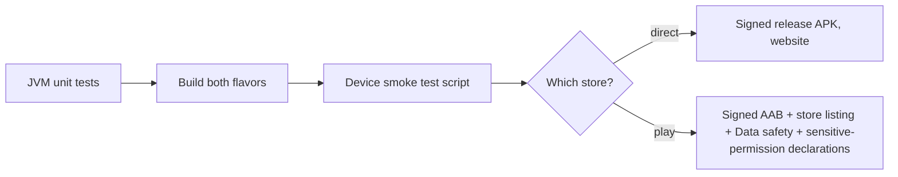

# Step 15 — Testing, release & Play Store

## Feature
A repeatable way to prove the app works and to ship both builds.

## How it works (logic)



### What to unit test (no device needed)
| Area | Tests |
|---|---|
| Language | Devanagari → Hindi, "kya haal hai yaar" → Hinglish, English, blank |
| Prompt builder | all personalities × languages build; recap only when given |
| Latency tracker | ordered marks give right deltas; out-of-order ignored |
| Echo guard | counter and 450 ms tail with a fake clock |
| Tool-call dedupe | same id runs once |
| Tools | app matching, contact ranking, no-device fallbacks (`accessibility_not_enabled`, `not_found`) |
| Visual agent (direct) | every legal/illegal state transition, blockers, DRAFT never publishes, stale observations, confirm needs a prior yes |
| Licensing (direct) | active / expired / blocked rules |
| Forge | SSE parser, fences, truncation repair, stage detection, safety net, error mapping, chat intent |

Run: `./gradlew testDirectDebugUnitTest testPlayDebugUnitTest`

### Device smoke script
1. "Hello, kaise ho?" → Hinglish reply.
2. "Open YouTube" → app opens. 3. "YouTube par Arijit Singh ka gaana chalao" (direct) → read-screen loop.
4. "Mummy ko call karo" → dials. 5. "Rahul ko WhatsApp pe bolo main 5 minute me aa raha hoon" → composer (play) / sent (direct).
6. Switch personality mid-conversation → no re-greeting.
7. "Ek cafe ki website banao" → Forge opens, builds, reveals.
8. Wi-Fi off for 3 s mid-conversation → reconnects.

### Release checklist
- Release build: minify + shrink resources; signing from a git-ignored `keystore.properties`; bump `versionCode` (Play rejects a reused code).
- `play` flavor: no accessibility service, no `QUERY_ALL_PACKAGES`, no overlay permission, no licensing. Declare the microphone foreground service type and explain `READ_CONTACTS` / `CALL_PHONE` in the Data safety form and permission declarations.
- Store listing: short description (≤ 80 chars), full description (≤ 4000), screenshots and feature graphic, content-rating questionnaire, privacy policy URL.
- Never commit: keystores, `keystore.properties`, backend config files, API keys.

## Build prompt (copy-paste)

```text
Add the test suites and release setup for Lia AI.
1) JVM unit tests (JUnit4, kotlinx-coroutines-test, org.json) for every pure component listed in the
   table, split into src/test (common), src/testDirect and src/testPlay. Use fakes instead of mocks
   for ScreenDriver and clocks. Run with ./gradlew testDirectDebugUnitTest testPlayDebugUnitTest.
2) Release: proguard-rules.pro keeping org.json and Compose needs; release buildType with
   isMinifyEnabled and isShrinkResources; signingConfig read from keystore.properties if present
   (git-ignored); versionCode/versionName in defaultConfig.
3) A docs/PLAYSTORE_LISTING.md with: artifact to upload (play AAB), listing copy, data-safety
   answers, permission justifications (microphone foreground service, contacts, call), and the
   submission checklist.
4) A DebugScreen ("Voice Pipeline Debugger") that shows connection state, selected personality,
   configured and detected language, VAD, mic state and per-turn latency from VoiceLatencyTracker.
Do not add any secrets to the repository.
```

## Done when
- [ ] Both unit-test tasks are green.
- [ ] `assemblePlayRelease` produces a signed bundle without any accessibility declarations.
- [ ] The smoke script passes on a real device (emulator microphones are unreliable).
